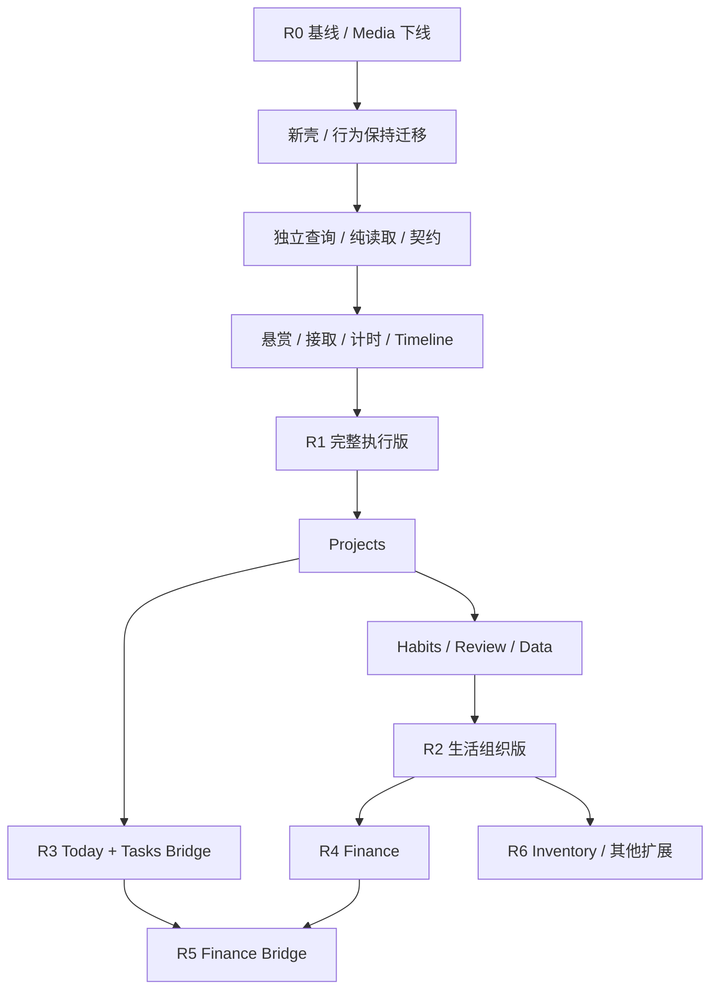

# Workbench vNext 开发计划

版本：v1.0 · 2026-09-17 · 待实施  
依据：[PRD](PRD_VNEXT.md) · [功能设计](FUNCTIONAL_DESIGN_VNEXT.md) · [Finance PRD](PERSONAL_WORKBENCH_FINANCE_PRD.md)

## 1. 实施原则

目标是逐步交付一个能长期使用的产品：先保住悬赏执行闭环，再把现有功能归位，随后交付新领域。结构迁移与语义变更分 PR；每个工作包必须有可运行／可核对结果，不以创建空目录或占位路由结束。

当前工作区已有 Rewards feature、部署与 migration 命名相关改动。先登记其状态、核对归属，再继续开发；不回滚、覆盖或误当作本计划已实现。旧 PRD 保留，未来事实变化在同次实现中更新 ARCHITECTURE。

## 2. 版本路线与工作量

估算单位为有效工程人日，假设一名熟悉 React / Hono / MySQL 的开发者，含实现、聚焦测试、基本 UI 验证；不包含等待产品反馈、生产访问授权和外部钱包供应方。范围不确定性较大，R0 后重估，不能把人日直接当作保证交付日期。

| 版本 | 用户可获得的结果 | 工作包 | 估算 |
| --- | --- | --- | --- |
| R0 范围与基线 | 现状有据可查，Media 下线具备可恢复步骤 | B00–B01 | 3–5 人日 |
| R1 悬赏执行版 | 完整悬赏板、可靠计时与 Timeline、日周日历、既有功能归位、基础设置搜索 | B02–B12 | 29–44 人日 |
| R2 生活组织版 | Projects、通用习惯、周／项目／学习复盘、全局搜索、导入与恢复 | B13–B16 | 16–24 人日 |
| R3 Bridge v1 | Today + Tasks 授权读取和候选悬赏写入闭环 | B17–B18 | 7–11 人日 |
| R4 Finance 首版 | 可核对账户／流水、转账、预算、周期、报表、数据维护 | B19–B22 | 18–28 人日 |
| R5 财务集成 | Finance 投影与外部钱包事实对账 | B23–B24 | 6–11 人日；外部钱包执行实现不计入 |
| R6 后续扩展 | Inventory、月历／重复计划／提醒、里程碑、决策工具完善 | B25–B28 | 15–25 人日，前序反馈后重估 |

R0–R4 合计 73–112 人日；按单人每周 5 个有效工程日约 15–23 周。R1 可先在 B08 后发布核心试用，再在 B12 完成完整版本。若优先满足 Agent 接入，R3 可在 R1 + B13 + version/权限前置条件完成后插入，不必等待全部习惯功能；Finance 实现不依赖 R3。

## 3. 工作包

### R0：先建立可信基线

| ID | 交付／涉及 owner | 依赖 | 验收与注意点 |
| --- | --- | --- | --- |
| B00 现状、迁移和行为基线 | 保存任务／接取／Timer／Timeline／奖励／记录的基准样例；记录工作区改动；在可访问环境核验 schema 和 Flyway history | 无 | typecheck、lint、build 结果有记录；新库和已部署库迁移路径明确；记录数据数量与汇总，不输出个人正文或凭据 |
| B01 Media 下线 | Web、API、Dashboard、schema、OpenAPI、前向 migration；数据库备份与恢复说明 | B00 | 应用代码和文档接口无残留；旧 V8 不改；先部署不依赖 Media 的应用，再执行删除表，备份可恢复；不迁到其他产品 |

B00 必查：实际部署是否执行过旧 `V2__schedule_kind.sql`。当前工作区的 `V2_1__schedule_kind.sql` 只是文件状态，不能据此判断生产迁移已修好。分别记录新环境从零 migrate 与现有环境 validate 的结果；禁止为通过校验直接改 checksum 或无依据 repair。后续迁移编号从核验后的最大版本分配，不提前保证一定是 V17。

### R1：悬赏执行与现有功能收口

| ID | 交付／主要文件 owner | 依赖 | 完成标准 |
| --- | --- | --- | --- |
| B02 App Shell / Router | Web composition、路由、桌面导航、移动导航、登录返回地址 | B00；正式发布前 B01 | 当前功能可从新壳访问；直接打开／刷新／前进后退有效；服务器有 SPA fallback；不改业务语义 |
| B03 行为保持的 feature 提取 | Today / Tasks / Calendar / Records 工作流逐个迁出 App；复用既有 Rewards 公共入口；统一 request 与必要 UI primitives | B02 | 每批与基线操作结果一致；表单草稿归各 owner；App 不再新增业务状态；不按行数机械拆文件 |
| B04 纯读与结转 owner | 新 `/today`、旧 Dashboard 兼容纯读、显式结转；审查所有 GET，成长初始化迁至注册／显式修复命令 | B00、B03 | 连续 GET 不改业务行（含 Rewards 等间接 ensure 调用）；结转重试无重复；默认待续接与自动接取设置均能说明行为差异 |
| B05 Domain Query / Contracts / Query cache | Tasks 列表／详情、Schedule 范围查询与更新、共享核心 schemas、OpenAPI、错误 envelope、version；接入 TanStack Query | B03–B04 | 页面独立加载；Query 不重试非幂等写入；用户切换清空隔离缓存；表单更新不丢草稿；Task 可未分类、可编辑优先级／预计时间 |
| B06 悬赏板与日接取 | 卡片／列表、筛选、详情、发布并接取、Top 3、撤回、接取列表 revision | B05 | AC-01、AC-09；排序／筛选写入 URL；接取不自动开始，开始快捷操作能原子接取 |
| B07 执行事务核心 | Timer Session/Segment、单未结束 Session、pause/resume/finish/cancel、Task 完成、时间投影、奖励公开事务契约 | B05–B06 | AC-02/03/04/05/07；并发、重试、失败回滚通过；停止与完成分离；旧记录策略可核对 |
| B08 Today / Timeline / Calendar 完整闭环 | 新 Today 布局、跨页 timer、计划与实际来源、补录／更正、日周视图、计划状态 | B06–B07 | AC-06/12；跨午夜与暂停空档正确；计划不自动生成实际；375px 操作可用；可发布核心试用 |
| B09 Routines / Journal 归位 | Sleep、Water、晨写、日记、股票复盘、各域历史；草稿保护 | B03、B05 | AC-10；原记录可查可改；History 一级入口移除且历史仍可达；不合并专用表 |
| B10 Rewards / Insights / Tools 归位 | 既有 Rewards feature 适配独立读；成长、AI、决策二级入口；新计时奖励规则与历史策略说明 | B07、B09 | 商店／兑换回归，奖励展示可关；暂停不刷奖；AI 删除不动源记录；原玩法不会因迁页丢失 |
| B11 Settings / Search / Export | 类别／能力映射、资料、外观、习惯目标、结转与展示偏好；任务／日记／日历搜索；分域导出 | B05、B09 | 修改停用分类不毁历史；搜索深链用户隔离；导出能核对数量，配置实际生效 |
| B12 R1 收口 | 统一统计口径、加载错误空态、键盘／焦点／触控、迁移兼容清理、旧 App 业务移除 | B08–B11 | 完整 PRD R1 演示通过；旧与新统计差异可解释；无已迁页面仍全量依赖 dashboard |

B03 采用小批次责任迁移，不要求一次搬完所有模块才验证。B05 的 contracts 首批只含实际要共享的 Task／时间／envelope；npm workspace 扩展到 `packages/*`，构建次序和类型消费同次配置，不建空泛 shared 包。React Router 和 TanStack Query 的具体版本在实施时按 React 18 兼容性核验并锁定。

B07 先在后端建立原子命令与聚焦测试，再切换 UI。数据库事务覆盖 Session/Segment、必要 Assignment、Schedule 投影、Task 状态／完成历史和奖励事件；复用已有 rewards InClient 能力并按需要扩展，不在事务内再开独立奖励事务。单用户执行互斥用用户执行状态锁，不以“先查再写”代替并发约束。

### R2：补齐长期组织与生活维护

| ID | 交付 | 依赖 | 验收 |
| --- | --- | --- | --- |
| B13 Projects MVP | 项目 CRUD、projectId、所属悬赏、进度、笔记、日期、计划／投入、归档恢复 | R1 | 创建项目→发布所属悬赏→接取计时→项目看到投入；改归属不复制任务；无任务进度为空 |
| B14 通用 Habits | 定义、频率／目标生效规则、Occurrence、记录／跳过、历史；专用记录投影；转今日悬赏 | B13（可在接口稳定后独立实施） | 每日／每周 N 次正确；改规则不改历史；喝水／晨写不双写；转任务同日幂等 |
| B15 Reviews / Analytics / Search 扩展 | 周／项目／学习复盘、预设投资入口、周月统计、来源引用；新增域搜索 | B13–B14 | 周范围、跨日裁切、项目累计不重复；引用与正文分离；AI 为派生数据且失败不影响保存 |
| B16 Data 完善 | 回收站、导入预览与批次去重、恢复演练、数据导出格式版本 | B13–B15 | 源数据→导出→新环境导入后主对象数量／时间总量可核对；失败重试不重复 |

### R3：Agent Bridge v1

| ID | 交付 | 依赖 | 验收 |
| --- | --- | --- | --- |
| B17 Grant 与受限读取 | 集成凭据、scope、到期／撤销、Today + Tasks 白名单投影、深链、读审计 | R1、B13；核心对象 version 已具备 | AC-11；无 Web token 复用、无直连数据库；取消授权立即生效，跨用户请求拒绝 |
| B18 Candidate 与写入 | Candidate 审阅／拒绝／过期、确认发布／接取、精确低风险授权、mutation audit | B17 | 确认两次只有一条 Task；409 不覆盖用户修改；操作可追溯，AI 判断不混入事实字段 |

### R4：Finance 首版

| ID | 交付 | 依赖 | 验收 |
| --- | --- | --- | --- |
| B19 / FIN-01 基础账本 | 账户、分类、期初、收入支出、明细、余额查询 | R1 契约与设置基础；推荐 R2 后发布 | 金额整数分，余额只来源于有效分录，账户隔离 |
| B20 / FIN-02 转账与更正 | 双向转账、退款、冲正、归档、版本冲突 | B19 | 转账不计收支；失败全回滚；重试不重复 |
| B21 / FIN-03 日常管理 | 月／分类预算、周期模板与待确认项、报表、Quick Add | B20 | 未确认周期不动余额；报表与流水核对，跨月退款口径一致 |
| B22 / FIN-04 数据维护 | 财务导出／导入预览／去重、账户对账、敏感操作审计 | B20–B21、B16 | 恢复每账户余额相同；重复来源不二次入账；完成 Finance PRD 全部样例 |

### R5–R6：集成与扩展也有明确落点

| ID | 交付 | 依赖 | 验收 |
| --- | --- | --- | --- |
| B23 / FIN-05 Finance Projection | 独立敏感 scope、余额／预算最小字段投影、撤销／过期 | B17、R4 | Today 授权不能读财务；授权范围内返回可追溯事实 |
| B24 / FIN-06 Wallet / Payment Effect 对接 | 明确外部钱包 owner、交易状态、来源 ID、结果映射、对账纠错 | B23；外部钱包契约与环境 | 只有成功交易记账，重复通知不重复入账；失败／待定不扣款；钱包不并入金币 |
| B25 Inventory MVP | 物品／位置／状态／保修／维护悬赏、可选关联财务交易 | R2；关联真实交易需 R4 | 一个物品能查维护历史；价格展示不另改财务余额 |
| B26 Calendar 扩展 | 月视图、重复计划、提醒偏好 | R1、B14 频率经验 | 改单次／改系列区分；提醒失败不影响计划与任务真值 |
| B27 Projects 里程碑 | 阶段、目标日期、关联任务与进度 | B13、B15 | 里程碑由关联事实计算，不出现另一份任务状态 |
| B28 Decision Tools 扩展 | 比较、加权决策、事前风险、结果回顾 | B10 | 决策记录能复查，转 Task 为显式命令；不用万能 JSON 混存核心实体 |

Activity Feed 与健康数据连接列入后续机会清单：只有明确使用场景后立项；前者只做派生事件列表，后者先确定数据来源和归属，不以本路线图授权泛化健康平台。

## 4. 数据迁移与兼容策略

1. **扩展后切换。** 先加 nullable 来源字段、version、计时片段与必要索引，旧读取保持运行；唯一索引建立前审计现存重复，不直接让 DDL 失败。
2. **保留历史。** Task 与 Assignment ID 不重建；已发奖励 event 和余额不重新发放。Media 是唯一明确移除的业务数据，仍先备份。
3. **计时旧数据。** 已有 PAUSED 行代表旧实现的一次停止，不直接当作可恢复新 Session。切换时对已有 RUNNING Session 展示核对结束时间；多条运行项需逐条处理，未收口前不启用新开始。
4. **关联旧时间记录。** 仅唯一可证实匹配的计时与 Schedule 补源 ID；其他作为 legacy Actual 保留。迁移报告列出关联率与未关联数量；旧期间仍以既有 Actual 为统计源，禁止补写导致双计。
5. **删除与恢复。** Task／Project／Journal 默认归档或软删除，时间更正和财务采用可追溯调整；已归档 Task 的事实用标题快照可读。常规迁移不硬删现有事实。
6. **API 兼容。** 旧 dashboard 与旧 timer 调用保留短期兼容适配；新 Web 切换、旧客户端访问记录清零并经过一个发布窗口后再移除。finish 的语义变化需新请求字段或明确契约版本，不能默改旧客户端的行为。
7. **回滚。** 应用回滚只到仍兼容新 schema 的版本；数据迁移采用前向修复，Media DROP 等不可逆步骤依赖已验证备份。生产恢复有数据截止点，不能声称代码回滚会恢复删除数据。

## 5. 测试与发布门槛

当前仓库无 test script。B00/B07 引入最小必要测试支撑，优先利用现有运行时和轻量夹具；不为了测试目录层次先扩建框架。以真实失败风险决定测试数量。

| 范围 | 必测内容 | 引入阶段 |
| --- | --- | --- |
| 执行规则 | Task 与 Timer 状态分离、暂停片段、取消、跨日按秒累计 | B07 |
| API / 数据库 | 用户隔离、单活跃 Session 并发、幂等重试、事务中途失败回滚 | B05–B07 |
| Projection | GET 无业务写入；时间来源去重；周范围与完成事件口径 | B04、B08、B12 |
| UI 工作流 | 发布接取、结束与完成按钮差异、跨页恢复、草稿不丢、冲突处理 | B06–B12 |
| Contract | Task / Timer / Schedule 请求响应与 OpenAPI；实际错误类型 | B05 起随接口变更 |
| Migration | 新库从零迁移、存量副本升级、版本唯一、旧记录数量与总量核对 | 每次 schema 变更 |
| Bridge | scope、撤销、字段白名单、跨用户、candidate 幂等 | B17–B18 |
| Finance | 转账双边原子性、整数金额、冲正、退款、周期／导入去重 | B19–B22 |

每个非平凡代码工作包运行仓库要求的 `npm run typecheck`、`npm run lint`、`npm run build`，再运行该包涉及的聚焦测试。lint 当前等同 TS 检查，不对外宣称有独立 ESLint 规则。只在失败、新改动或新风险出现时重复扩大验证。

发布检查：产品验收样例通过；新增 API 在 OpenAPI 有定义；schema 与 migration 一致；架构 ownership 变化写入 ARCHITECTURE；移动与桌面主要路径可用；必要备份和回滚版本明确。任一入口空白、假成功保存、重复计时／奖励、越权读取都阻断发布。

## 6. 架构差异审阅

| 项目 | 保留 | 计划变化与触发点 |
| --- | --- | --- |
| 应用边界 | Web → HTTP → Hono → MySQL；Drizzle / Flyway | B05 增加 contracts workspace，不直接 import API 源码 |
| 后端组织 | 简单 CRUD route 内聚 | B04/B07 只抽结转与执行等真实跨表事务；不要求全部搬 domains |
| 前端状态 | 表单草稿属于 feature，服务器持久化为真值 | B02 URL 管页面／日期；B05 Query 管远端快照；计时 UI 基于服务端 Session 派生 |
| 计时／时间 | Timer 与 Schedule 都保留 | B07 来源关联／片段／事务化，Schedule TIMER 只为投影 |
| Rewards | 既有 feature public index 与 rewards 服务 | 计时奖励策略显式版本化；任务／计时决定事实，奖励 owner 计算发放 |
| 领域增加 | 独立专用模型 | Projects、Habits、Finance 按各自交付加入，不建 Universal Entity |

本次仅增加规划文档与“待实施决策”记录，不把目标目录、API 或数据库结构写成已经存在。

## 7. 原建议覆盖索引

| 原建议主题／章节 | 本方案落点 |
| --- | --- |
| 定位、分层、IA、Today、移动布局（1–5、17–18、35–37、68–69） | PRD 1、4–6；功能设计 1–2；B02、B06、B08 |
| Tasks、Daily Assignment、Timer（6、9、38） | 功能设计 2.2、3–4；B06–B07 |
| Projects（7、54） | 功能设计 2.4；B13、B27 |
| Calendar、Sleep / Water（8、39） | 功能设计 2.3、2.5；B08、B09、B26 |
| Routines、Journal、Tools、Rewards、能力（10–14） | 功能设计 2.5–2.7；B09–B10、B14–B15、B28 |
| Finance、Wallet（15、62、68） | 独立 Finance PRD；B19–B24 |
| History、Search、Settings、数据（16、33–34） | 功能设计 2.8；B11、B16 |
| Router、前端拆分、状态、UI、响应式（19–21、48–51、65–66） | 本文 B02–B05、B12；功能设计 6 |
| Dashboard、纯读、契约、并发、幂等、删除（22–29、41、46–47） | 功能设计 3–4；B04–B07、B12、B16 |
| Auth、Bridge、隐私、Candidate（30–32、55–58、61） | 功能设计 5.1；B17–B18、B23–B24 |
| AI Insight、派生数据、Activity、拒绝万能实体（40–41、59–60） | 功能设计 2.7、4–5；B10、B15 |
| Media 删除、迁移历史（42–45） | B00–B01；本文 4 |
| Backend 目录与不过度分层（52–53） | 本文 6 与 ARCHITECTURE 待实施决策；保留 route-centric |
| 实施顺序、复用／扩展／删除、验收（62–67、70） | 本文 2–5；PRD 5、7 |
| 开篇扩展 Inventory、更多 Calendar | PRD WB-20/21；B25–B26，已登记而非首版插入 |
