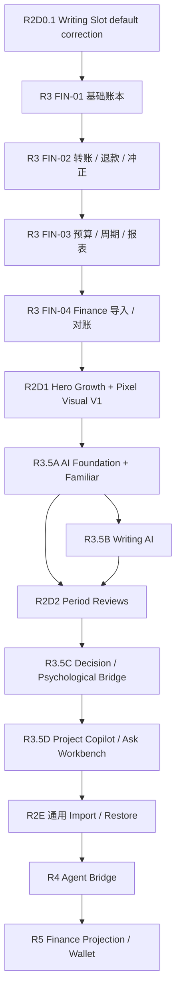

# Workbench vNext 开发计划

版本：v1.6 · 2026-09-24 · R2D1 Hero Growth 当前执行版

依据：[PRD](PRD_VNEXT.md) · [功能设计](FUNCTIONAL_DESIGN_VNEXT.md) · [Finance PRD](PERSONAL_WORKBENCH_FINANCE_PRD.md) · [架构记录](ARCHITECTURE.md)

## 1. 本次路线修订

2026-09-21 复审后，前半程已经不再是规划：R0、R1A、R1B、R1C、R1D、R1.5、R2A、R2B、R2C、R2D0 已通过各自 gate。路线的主要问题不再是“怎样同时开工”，而是 **下一批应先完成哪个核心真值域**。

本次调整：

1. R2D0 只保留一个小修：**新用户 Writing Slots 全部显式 opt-in**；既有用户偏好不强改。
2. **R3 Finance 调整为下一核心主线，并完整完成 FIN-01–04 后再进入剩余 Growth / AI。** 这不是新增依赖，而是用户优先级与 Personal OS 完整性判断。
3. Hero Growth 仍是产品世界观核心，在 Finance 后作为 R2D1 实施，并承担 Pixel Visual V1 的首次系统级落地。
4. 内部 AI 新增独立路线 R3.5，与 R4 Agent Bridge 严格分离。内部 AI 负责理解/生成派生结果；Bridge 负责外部授权与候选动作。
5. AI 采用 deterministic-first：统计、日期、金额、完成率先由 code/SQL 计算；Jev 只做判断/分类/筛选/路由；LLM 只用于语义理解、写作与复杂推理。
6. 通用 R2E Import 不再阻塞 Finance。FIN-04 自己拥有 FinanceImportBatch 与来源行幂等；R2E 后续复用已验证模式。
7. 像素资产制作是可并行视觉轨，不作为 Finance 或数据模型 gate。前端代码先在 Growth/Familiar 等世界观表面落地，不先全站换皮。

当前建议顺序：

```text
R2D0.1 Writing Slot 默认修正
→ R3 FIN-01 基础账本
→ R3 FIN-02 转账 / 退款 / 冲正
→ R3 FIN-03 预算 / 周期 / 报表 / 快速记账
→ R3 FIN-04 财务导入 / 对账 / 敏感导出
→ R2D1 Hero Growth + Pixel Visual V1
→ R3.5A AI Foundation + Familiar Shell
→ R3.5B Morning Writing / Journal / Text→Task AI
→ R2D2 Period Reviews
→ R3.5C Decision / Psychological Bridge
→ R3.5D Project Copilot / Ask My Workbench / Stuck Insight
→ R2E 通用 Import / Restore
→ R4 Agent Bridge
→ R5 Finance Projection / Agent Wallet 对账
→ R6 独立扩展
```

### 1.1 当前实际起点

当前已验收：

- R0 数据/语义安全基线：PASS。
- R1A Domain Semantics：PASS。
- R1B Transaction Workflows：PASS。
- R1C App Shell：PASS。
- R1D Execution Vertical Slice：PASS。
- R1.5 Quick Notes / Search / Settings / Export：PASS。
- R2A Projects：PASS。
- R2B Trash / Project Materials：PASS。
- R2C Habits：PASS。
- R2D0 Core UX / Personalization：PASS；仅 Writing Slot 新用户默认策略需小修。

R2D0 已建立七个通用 Task Category、自定义颜色、nullable Growth mapping、Writing Slot 偏好、wake-date Sleep 语义、Today Utility Rail、移动统一 Quick Action、补录候选过滤与完成时可选补录。接下来不再重复这些已成立能力。

目标产品行为与当前实现有一个明确差异：

```text
当前新用户：Morning Writing ON / Journal ON / Stock Review OFF
目标新用户：Morning Writing OFF / Journal OFF / Stock Review OFF
```

R2D0.1 只修新注册 seed / UI 文案与测试；既有 `writing_slots` 不迁移强改，历史正文继续可达。

## 2. 当前发布门槛与执行顺序

| Gate | 状态 | 范围 / 下一步 |
| --- | --- | --- |
| R0 | ✅ PASS | 数据/迁移/纯读/Media 应用下线 |
| R1A | ✅ PASS | 核心语义、Segment、时区/归属快照、receipt |
| R1B | ✅ PASS | 原子命令、幂等、slot 串行化 |
| R1C | ✅ PASS | Router、Query、AppShell、跨路由 Timer |
| R1D | ✅ PASS | 可日用执行闭环 |
| R1.5 | ✅ PASS | Quick Notes、Search、Settings、Export |
| R2A | ✅ PASS | Projects |
| R2B | ✅ PASS | Trash + Project Materials |
| R2C | ✅ PASS | Habits / Routines |
| R2D0 | ✅ PASS + small correction | Core UX / Personalization；先补 Writing Slot 新用户默认 |
| **R3** | **✅ COMPLETE** | Finance FIN-01–04 完整首版 |
| **R2D1** | **CURRENT** | Hero Growth + Pixel Visual V1 |
| R3.5A/B | NEXT after R2D1 gate | AI Foundation + Familiar；Writing AI |
| R2D2 | Pending | Period Reviews，确定性事实为底、AI 可选 |
| R3.5C/D | Pending | Decision / Psychological Bridge / Project Copilot / Ask Workbench |
| R2E | Pending | 通用 Import / Restore |
| R4 | Pending | 外部 Agent Bridge |
| R5 | Pending | Finance Projection / Agent Wallet 对账 |
| R6 | Pending | Inventory / Calendar 后续 / ProjectSection 等扩展 |

### 2.1 当前工作包

| 顺序 | 工作包 | 交付 | 启动条件 | 退出点 |
| --- | --- | --- | --- | --- |
| 0 | `WB-R2D0-WRITING-SLOT-DEFAULT-CORRECTION-001` | 新用户三个 Writing Slot 全 OFF；既有偏好不改 | R2D0 PASS | READY_FOR_FINANCE |
| 1 | B19 / FIN-01 | 账户、财务分类、期初、收入/支出、账本、余额 | R2D0.1 | 可每天真实记账；余额完全可追溯 |
| 2 | B20 / FIN-02 | 转账、手续费、退款、冲正、归档、并发 | FIN-01 | 双边原子、幂等、409、审计成立 |
| 3 | B21 / FIN-03 | 预算、周期候选、报表、统一 FAB 快速记账 | FIN-02 | 计划/真实分离，报表=账本 |
| 4 | B22 / FIN-04 | Finance 导入预览/去重、敏感导出、对账 | FIN-02/03 | Finance PRD 样例全过；不依赖通用 R2E |
| 5 | B30 / R2D1 | Hero Growth、N 维配置、技能/里程碑、Pixel Visual V1 | R3 | 每个值可追源；视觉不改业务 truth |
| 6 | B31 / R3.5A | AI Gateway、provider abstraction、预算/成本遥测、AI Artifact、Familiar shell | R3 + Growth 基础 | 不改变任何领域 truth；真实最小 AI vertical slice |
| 7 | B32 / R3.5B | 晨写梳理、Journal Insight、Text→Task candidates | B31 | 派生结果有来源/version/cost；写 Task 必须确认 |
| 8 | B15 / R2D2 | 周/月 Period Review、事实快照、个人正文、可选 AI 草稿 | B30；B31 可选增强 | 区间/快照/正文 owner 成立，AI 失败不阻塞 |
| 9 | B33 / R3.5C | Decision Assistant + Psychological Bridge | B31 | AI 不替用户决定；候选 Task 经确认 |
| 10 | B34 / R3.5D | Project Copilot / Ask Workbench / Stuck Insight | B31 + stable domain reads | deterministic-first、最小 context、来源可追 |
| 11 | B16b / R2E | 通用 Import / Restore | 各域稳定 export | 不重复、引用映射、恢复核对 |
| 12 | B17–B18 / R4 | Agent Bridge | 核心域 + Grant contract | scope / candidate / audit |
| 13 | B23–B24 / R5 | Finance Projection / Wallet reconciliation | R3 + R4 | 敏感 scope 独立、外部结果幂等 |
| 14 | B25–B28+ | 扩展 | 各自前置 | 独立发布 |

### 视觉并行轨

视觉资产制作现在即可并行，不占业务迁移 gate：

1. Familiar / Hero 角色基准；
2. Nav / Category / Utility / Growth icons；
3. Pixel Visual tokens；
4. Growth 页面首次系统集成；
5. Familiar shell 集成；
6. 其它页面逐步使用 Pixel accents。

禁止为了像素风重写编辑器、日期控件、表单、状态 ownership 或 Design System。

### 2.2 并行开发的共享边界

- 每个任务 brief 写清：输入契约／版本、owner、允许修改的文件、公开导出、依赖、验收命令、禁止触及的共享文件。依赖未满足标阻断，先做不依赖部分，不臆造第二套 API。
- 不同线优先独立 worktree／分支；若同目录协作，严格按文件 owner 分配。每线使用自己的测试库或隔离 fixture 范围，不能互相清理数据库。
- `db/schema.ts`、`db/migration/` 的编号、`docs/openapi.yaml`、contracts 公共导出、workspace manifests/lockfile、`App.tsx`/router/app.ts 接线、ARCHITECTURE 由当组集成负责人统一写入，其他线提交最小变更提案，不同时抢改。**同文件或同事务 owner 的改动按序合入，不叫并行。**
- 先冻结各线实际需要的最小契约，再并行开发。契约改变须通知全部消费者；集成负责人统一调整后重跑受影响验证。不会为了并行造 command bus、万能实体或大共享 store。
- 每线先通过自己的聚焦检查，合并后在同一集成版本运行跨域验收；mock／单线通过只表示待集成。R1B 的完整原子性和 R1D 的真实端到端链不能分线各自宣称已完成。



Finance FIN-04 自己拥有 FinanceImportBatch / source-row identity，不再等待通用 R2E。通用 Import 后续可以复用 Finance 已验证的预览、来源行幂等与错误报告模式，但只有出现第二个独立消费者后才抽共享批次 contract。

## 3. R0：数据与语义安全基线

下一个建议任务：**`WB-R0-DATA-SEMANTICS-AUDIT-001`**，先调查，不开始新版 Today。

| 子阶段／工作包 | 具体交付 | 退出门槛 |
| --- | --- | --- |
| R0.1 / B00a | 记录工作区现状、部署代码版本、数据库 schema、Flyway history/checksum；计时／Schedule 可关联率、多活跃 Session、记录数量／汇总；随手记与旧周报存量 | 新库／已部署库差异有报告；重复 V17 的处理方案按真实部署决定；未查到生产 history 明确记阻断，不能猜 |
| R0.2 / B00b | 运行现有 API/Web 测试与必要检查，记录不变量、已通过案例和后续待实现案例 | 已有事务／重试／回滚用例在隔离测试库通过；测试缺环境必须报失败／阻断；不把 skip/TODO 算通过 |
| R0.3 / B04a | 所有业务 GET 移除写入；结转成为显式幂等命令，成长初始化迁至注册／显式修复；旧 Web 必要行为由明确命令触发 | Dashboard、Rewards 等聚合读不新增／更新业务行；重复结转只处理一次；打开历史无副作用 |
| R0.4 / B01a | 隐藏／移除 Media UI，停止调用与 API、聚合／OpenAPI 注册；应用脱离该表 | 无运行路径引用 Media；其他文字记录（尤其 Quick Notes）正常；此时允许表暂留 |
| R0.5 / B01b | 核验生产 history，备份并完成隔离恢复，新增前向 DROP 迁移，执行后清理闲置 ORM 映射 | 备份可恢复、当前应用不引用表、迁移版本唯一且发布窗口明确；未满足时延后物理删除，不提前删除表 |

B00b 先锁住已经存在的完成／终结事务和手动 Actual 行为。pause/resume 排除空档、跨日拆账、单活跃 Session 等尚未实现的不变量先写成明确场景与数据样例，在 R1A/B 实现后成为必须通过的自动化测试；不要求 R0 提前实现整套 Timer，也不允许用跳过测试伪装完成。

R0.3 的结转先抽出现有行为并保证命令幂等；“默认待续接、跨多天合并、不复制旧时钟位置”的目标语义在 B04b 单独切换，结构迁移与语义改动分开。

## 4. R1A–R1D：一次打穿执行闭环

### R1A — Domain Semantics

B07a 负责语义与持久化扩展，B05a 负责核心输入／输出契约、独立 Query API 与必要 version。依赖 R0，不依赖 Router 或其他页面全部提取。

- 明确 Task 长期状态与 Assignment 当日选择／结果；定义 Session / Segment、起止时间、取消／更正、单活跃 Session。
- 六项设计以功能设计 3.1–3.5、4.1 为冻结输入：Assignment continuation resolution；`user_execution_slots` 唯一用户行与锁序；user.timezone／recordTimezone／periodTimezone 快照；项目／类别发生时归属；reopen 后独立 Completion Event；一次动作一个 operationId／receipt。R1A 先固定字段与约束，R1B 再实现全部命令，不留给并行开发线临时自行选择。
- TimerSegment 为计时 canonical truth，Session 为工作流与来源；Schedule TIMER 为可重建投影；Manual/legacy Actual 为各自原始事实。统一 ActualTime 查询每个来源只纳入一次，规则不能各页面复制。
- 现有 `(userId, TIMER, sessionId)` 投影唯一约束只支持一 Session 一块；必须前向迁移为片段／日期切片身份，保留旧来源兼容，再启用 resume。不可只加 Segment 表后任由旧唯一约束阻止第二片段。
- 时间事实保存绝对时刻、记录时区与稳定 businessDate；跨日裁切使用原记录时区。Assignment/Journal 等日期实体保存显式业务日期与时区，不凭 UTC 午夜反推日期。详见功能设计 3.3。
- TimerSegment／手动 Actual 在 R1A 就带可空 `projectIdAtOccurrence` 与 `categoryIdAtOccurrence`；Projects 未上线时明确“当时无项目”，旧记录未知则另标未知。移动 Task 只影响未来片段；运行中变更归属先暂停。R2 不得按当前项目静默补改旧投入。
- 奖励账本正确性、幂等键、历史保留是 P0；角色页／商店改版与动效均不在这里。

**Exit gate：** 数据与状态图无双真值；迁移能在隔离存量副本和新库验证；暂停／跨日样例结果唯一可解释；Task/Timer 核心契约与 OpenAPI 对齐；已实现工作不回退。

### R1B — Transaction Workflows

B07b / B06a / B04b 在既有 `work-session.ts`、`task-completion.ts` 公共能力上补齐命令。一个用户原子动作由一个后端事务 owner 负责，前端不串联独立 API 去假装事务。

| 命令能力 | 事务 owner／范围 | 要求 |
| --- | --- | --- |
| acceptTaskForDate / releaseAssignment | Tasks / daily assignments | 日期唯一、排序／重点 revision；接取状态和 continuation resolution 独立 |
| acceptAndStartTask | Execution 应用工作流调用 Tasks 公开事务能力 | Assignment + Session + 首片段 + 必要 Task 状态全成或全败 |
| pause / resume | Execution | 关闭／开启片段与时间投影一致；暂停空档不计入 |
| finishCurrentSession | Execution + Rewards | 结束／汇总／投影／计时奖励同事务；默认不完成 Task |
| completeTask | Task completion | 每次真实 DONE transition 新建完成事件，首次奖励单独去重；直接完成不强制补录 |
| completeTaskAndFinishSession | Execution 调用 Task completion 公共能力 | 计时、完成与两类幂等奖励一致；不嵌套独立奖励事务 |
| carryOverAssignment / resolveContinuation | 显式结转工作流 | 源 Assignment 版本及 PENDING/DEFERRED 条件校验；源决定／目标接取同事务，保留忽略／撤回决定 |
| recordManualActual / correct / cancel | Calendar 或 Execution 按来源拥有 | 手动补录不默认完成；源更正与投影／奖励调整一致 |

这些是业务能力名，不要求新增八套资源或机械 CQRS。所有写命令使用功能设计 3.5 的 operationId／mutation_receipts，统一身份／fingerprint／结果回放，领域事务仍由各 owner 负责。开始前锁每用户 `user_execution_slots`；pause 保留 slot、finish/cancel 同事务释放。复用旧终结逻辑但不能继续把 `sessionId + action` 用作所有新动作的永久幂等键。

**Exit gate：** API/数据库测试证明重复提交、并发终结、断网响应丢失后重试无重复事实／奖励，事务中途失败整体回滚；AC-01–09 与 AC-26–33 的对应服务端场景通过。至少覆盖两次合法 resume 各自重试、reopen 再完成、忽略后不重现、slot 缺行／并发开始、跨时区／归属变更。后端可在无需新 UI 的情况下跑通同一链。

### R1C — App Shell

B02 / B03a / B05b 在 R1A 契约冻结后可与 R1B 并行开发；R1C 验收仍依赖 R1B 已通过且接通真实命令与查询。

- 引入真实 Router；只提取这次会修改的 Tasks / Assignments / Timer / Timeline / Today 协作表面，保留现有 Rewards、Decision Tools、Writing / Reflection public surface。
- 以 TanStack Query 管 current session、当日接取、Task detail、Timeline；Query key 含用户／日期／资源标识，mutation 明确 invalidation。mini timer 从同一服务端 Session 派生，不保存另一份运行状态。
- `packages/contracts` 只放实际共享的核心 schema/DTO，不含数据库和服务；配置 workspace 构建顺序，避免 Web import API 源码。具体库版本在实施时验证兼容。
- 顶层负责 session、导航、composition；表单草稿在 feature 内。不以“清理整个 App.tsx”作为发布门槛。
- 旧生活／文字／设置／商店页面通过可用过渡入口继续访问，只有已可用页面进入路由；不增加假占位页面。

**Exit gate：** 任务深链／刷新／浏览器前后退有效，Today 与详情／mini timer 状态一致，登录切换缓存隔离，同日后台刷新不覆盖草稿，旧入口仍可 CRUD。

### R1D — Execution Vertical Slice

B06b / B08 / B12a 完成 Today、悬赏板、Task Detail、跨页计时器、Timeline 日视图、Calendar 日／周、今日接取／待续接、Quick Add 任务／计划／补录。基本完成奖励反馈沿用，商店改版不阻塞。Journal 沿用可用入口完成链尾反思。

**Exit gate / 里程碑 `WB-EXECUTION-VERTICAL-SLICE-001`：**

1. 发布 → 接取 → 开始 → 暂停 → 恢复 → 结束本次（Task 未完成）→ 再次投入 → 完成 → 时间与奖励核对 → Journal。
2. 不计时直接完成、补录不完成、跨日、第二设备冲突、响应丢失重试、历史日期查询通过。
3. 375px 与 1440px 主要操作可用；加载／失败／空态和焦点基础可用；不存在假保存成功或重复奖励。
4. 只要求核心切片行为成立；不以随手记完整库、Search、Growth、全面设置、所有旧页面重写作为门槛。

## 5. R1.5：既有功能归位与随手记

依赖 R1D，完成后形成第二个可独立发布的版本。

| 工作包 | 交付 | 退出门槛 |
| --- | --- | --- |
| B03b / B09 | Sleep / Water / 晨写 / 日记 / 股票复盘归位；复用已提取 Writing / Reflection；各域历史 | 原记录数量与编辑能力保留；草稿保护 AC-10；移除万能 History 后仍能找到旧数据 |
| B10 | Rewards UI、兑换历史、Growth 过渡摘要、Insights / Decision Tools 二级入口与展示设置 | 账本不重写；新旧奖励策略明确；展示开关不改变事实；成长角色页留 R2 |
| B29a 随手记基础 | 复用 quick_notes；Quick Add／Today 轻入口／Journal 灵感库；分页／详情／编辑／标签；归档软删恢复；幂等创建与同事务奖励 | AC-13/16/17；保留 6 XP / 2 金币规则，编辑／恢复／导入不重发；旧硬删除与列表契约迁移明确 |
| B29b 随手记转行动 | 确认摘要→发布／发布并接取；来源关联；引用进 Journal 草稿 | 依赖 B29a 与 R1B；AC-14/15/18；每条笔记一个直接转换 Task；5000→2000 字不静默截断；个人文字不随 Task 授权被展开 |
| B11 | 设置：资料／类别／目标／外观／结转／展示；基础 Search（Task/Journal/QuickNote/Calendar）；分域导出 | 普通 SQL 查询与分页，不建统一索引平台；深链有效、导出可核对 |
| B12b | 归位回归、通用状态、键盘／触控、废弃兼容清理 | R1D 关键路径无回退，随手记闭环可用；只移除已无消费者的旧代码 |

Quick Notes 前端应有自己的 owner／public surface，不能为补入口把状态继续堆进 App 或塞入 Writing / Reflection 内部。

## 6. R2：Personal OS、Growth 与 Reviews

| 子阶段／工作包 | 状态 | 交付 / 当前结论 |
| --- | --- | --- |
| R2A / B13 Projects | ✅ PASS | 单项目归属、Project CRUD、投入/进度、QuickNote material |
| R2B / B11b + B16a | ✅ PASS | Project Search/Export、Trash composition |
| R2C / B14 Habits | ✅ PASS | daily/weekday/weekly-N、effective rules/goals、Occurrence、skip、Task link |
| R2D0 | ✅ PASS + 小修 | 分类/颜色/Writing Slot/Sleep/Today UX；新用户 Writing Slot 默认值待修 |
| R2D1 / B30 Growth | **CURRENT（2026-09-24）** | Hero Growth、可配置 N 维、ActualTime / CompletionEvent 派生投入、Pixel Visual V1 |
| R2D2 / B15 Period Reviews | Pending | 周/月事实快照、个人正文、可选 AI 草稿、下一步转 Task |
| R2E / B16b Import | Pending | 通用跨域 Import / Restore；不再阻塞 Finance FIN-04 |

R2D1 的 Growth 仍以 Task → Category → GrowthDimension、Habit 明确 mapping、ActualTime occurrence attribution 与 Rewards ledger 为来源。Finance 可以在后续 Review/AI 中作为独立事实输入，但不混入 Growth 能力值。

Period Review 的基础事实必须 deterministic；AI 只写可选草稿。B31 AI Foundation 已存在时可复用，否则 Review 基线仍能独立完成。

## 7. R3–R6：Finance 优先，随后 Hero / AI，再受控集成

### R3 — Finance（当前下一主线）

| 工作包 | 交付 | 退出门槛 |
| --- | --- | --- |
| B19 / FIN-01 | FinanceAccount、FinanceCategory、Opening Transaction/Entry、收入支出、账本、余额 | 金额整数分；余额只来自有效 Entry；GET 纯读 |
| B20 / FIN-02 | 转账、手续费、退款、冲正、作废、账户归档、并发 | 双边原子性；operationId replay；409；转账不计收入支出 |
| B21 / FIN-03 | 月/分类预算、RecurringTemplate/Occurrence、报表、统一 Quick Action 快速记账 | 未确认周期不动余额；预算/报表与账本一致 |
| B22 / FIN-04 | FinanceImportBatch、导入预览/去重、敏感导出、对账报告、恢复核验 | 导入重试不重复；每账户余额恢复一致；**不等待 R2E** |

FIN-01–04 构成 R3 完整首版；不能把只有余额卡片或收入/支出 CRUD 的状态称为 Finance 完成。

### R3.5 — Internal AI / 指引魔法使

| 工作包 | 交付 | 退出门槛 |
| --- | --- | --- |
| B31 | AI Gateway、provider abstraction、per-feature budget、usage/cost telemetry、AI Artifact、source provenance/version/stale、Familiar shell | existing AI Insight / Decision Tools 可逐步接入；无业务 truth 迁移 |
| B32 | Morning Writing Guide、Journal Insight、Text→Task candidate | 结果有来源；失败不清草稿；候选写入需确认 |
| B33 | Decision Assistant、Psychological Bridge | 不替用户做最终决定；reasoning model 仅主动/必要时调用 |
| B34 | Weekly AI enhancement、Project Copilot、Ask My Workbench、Stuck Insight | code 先算事实；最小 context；可查看来源；cost 可量化 |

模型成本层：

```text
Tier 0 Code/SQL/Template → 默认
Tier 1 Jev → 只做判断/分类/筛选/routing
Tier 2 Cheap LLM → 梳理/生成
Tier 3 Reasoning LLM → 用户主动的复杂决策/深度分析
```

普通日报、金额、日期、完成率、时间分布禁止为了“AI 化”而调用模型。

### R4–R6

| 阶段 | 范围 |
| --- | --- |
| R4 / B17–B18 | 外部 Agent Bridge：Grant / scope / Candidate / audit；与 Familiar 内部 AI 分离 |
| R5 / B23–B24 | 敏感 Finance Projection + 外部 Agent Wallet / Payment Effect 对账 |
| R6 | Inventory、Calendar 月/系列、ProjectSection/里程碑、其它扩展 |

## 8. 数据迁移与兼容

1. **先核验再编号。** 两个 V17 必须按实际部署历史决定前向修复或未部署文件重新分配；历史 V2/V2_1、V8、V17 不无依据改写。新版本从核验后的最大值分配。
2. **扩展后切换。** 来源、version、日期时区与 Segment 先兼容扩展，验证旧记录可读；唯一索引建立前审计重复。当前一 Session 一投影约束必须先升级才开放多片段。
3. **真实时间来源。** 已有 PAUSED 行是旧终结语义，不直接恢复为新会话；存量 RUNNING 和多运行项先让用户核对。可唯一证实才关联旧 Timer/Schedule；其余保留 legacy Actual，统计仅纳入一次，不猜测补写。
4. **保留记录。** Task/Assignment/QuickNote ID、内容和既有 reward event 不重建；QuickNote 从硬删除转软删除只保护未来删除，无法凭 schema 恢复已硬删正文。归档不级联删除投入和奖励。
5. **日期归属。** 回填旧记录使用已有业务日期与既定 Asia/Shanghai 语义，记录迁移依据；不可根据服务器当前时区重新归日。周月总结的期间、时区与确认快照稳定保存。
6. **成长与周期总结。** 现有固定维度映射到稳定 GrowthDimension 标识，停用保留历史；调整目标有生效版本；已有 weekly_summaries 核验后迁到唯一 Period Review 写入 owner，核对正文、周期和数量。
7. **API 兼容。** 旧 dashboard / timer / quick-notes 列表和删除语义有明确过渡窗口；现有 completeTask 字段继续复用；新客户端切换及消费者清理后再删除适配，不默改旧行为。
8. **回滚与 Media。** 应用仅回滚至兼容新 schema 的版本；数据优先前向修复。Media 先应用脱离再 DROP，物理删除前备份恢复验证，不能宣称代码回滚恢复已删数据。
9. **续接与完成历史。** 存量 Assignment 只在可证实情况下初始化已处理决定；来源未知时由明确迁移报告／用户处理，不因 GET 扫描改写。已知 completedAt 可迁一条标记为 legacy 的完成事件，不能虚构无法恢复的多次完成；已有奖励资格按旧 eventKey 保留，迁事件不补发奖励。
10. **执行槽与操作回执。** slot 回填前处理多活跃 Session；注册创建和缺行补建只能走写命令。新旧客户端切换期间统一锁序，旧适配也经过相同 slot；operationId 与 receipt 先落地再启用新命令，回执和业务同事务。迁移编号由当组集成负责人分配。

## 9. 验证与架构门槛

复用现有 API 数据库 workflow 测试和 Web Vitest。已有 CI 的不允许 skip 规则继续执行；新增尚未实现的场景以明确需求列表登记，不能把跳过当通过。每次非平凡代码变更运行 `npm run typecheck`、`npm run lint`、`npm run build` 及涉及 owner 的聚焦测试；lint 当前仍是 TS 检查。

| 边界 | 重点验证 | 首次强制通过 |
| --- | --- | --- |
| 现有事实与迁移 | 两类环境 history、重复版本、数量／汇总、备份恢复 | R0；物理删除另有 R0.5 门槛 |
| GET 与结转 | 业务表不写入、成长初始化不藏在读里、结转重试幂等 | R0.3 |
| 执行规则／事务 | Session/Segment、slot 并发、续接 resolution、记录时区／归属快照、再次完成事件、operationId 回放／参数冲突、回滚 | R1B |
| 核心前端 | 单远端状态、深链、草稿、全链操作、移动端 | R1C/D |
| 随手记 | 创建＋奖励原子、转换幂等、长文摘要、软删、引用草稿／隐私、分页 | R1.5 |
| Growth／总结 | N 维配置、同口径公式、来源去重、周月裁切／快照／修订、AI 非覆盖 | R2D1–D2 |
| Finance | Entry 派生余额、双边转账／退款／冲正、整数金额、预算/周期、FinanceImportBatch 幂等、账户隔离 | **下一门槛 R3** |
| Internal AI | deterministic-first、artifact 来源/version/stale、预算/成本、用户确认写入 | R3.5 |
| Bridge | scope、白名单、撤销、候选确认、个人文字不因来源关联泄露 | R4–R5 |

每个退出门槛还须：契约变化同步 OpenAPI，schema 与 migration 一致，ownership 变化同次更新 ARCHITECTURE。简单 CRUD 保留 route-centric；只为实际跨域事务抽工作流；Web 与 API 仍只走 HTTP，共享 contracts 不得夹带 DB。Query 属服务器快照缓存，表单草稿留本 feature，Timeline/Growth/Search 均不能成为竞争性写入 owner。

本次是规划文档更新，不执行数据库修复、功能实现或生产发布；历史核验、测试通过与迁移部署不能以本文计划代替执行证据。

## 10. 需求与审阅追踪

| 需求／建议 | 落点 |
| --- | --- |
| 悬赏接取→计时→Timeline 主链 | PRD WB-01–05；R1A–D；WB-EXECUTION-VERTICAL-SLICE-001 |
| 原建议中的 IA／拆分／纯读／Contract | R0.3、R1C；B02–B05 分阶段落实 |
| Rewards 分账本正确性与展示 | R1A/B 与 R1.5；B07、B10，成长页 B30 |
| 随手记整合 | PRD WB-25；功能设计 2.9；B29、B11、B16 |
| 英雄培养式主页／N 维图 | PRD WB-26；功能设计 2.10；B30 |
| 周总结／月总结 | PRD WB-13；功能设计 2.11；B15 |
| R1 太大、容易相互等待 | R1A/B/C/D 独立退出门槛；现有功能归位移 R1.5 |
| 明确时间事实 owner 与 Segment | 功能设计 4.1、3.2；B07a，源真值与统一只读视图 |
| 原子用户动作由后端负责 | R1B 命令表；复用现有 workflow public contracts |
| 数据日期不随时区重新漂移 | 功能设计 3.3；B07a、迁移策略第 5 条 |
| Media 物理删除最后执行 | B01a/b；独立 R0.5 门槛，不挡安全解耦后的 R1 |
| Projects→Search/Trash→Habits | R2A–C 已完成；R2D0 个性化已完成并有一个 Writing Slot 默认小修 |
| 原生财务当前优先 | R2D0.1 后立即 R3 FIN-01–04；Finance 完整首版先于剩余 Growth / 内部 AI 与外部 Bridge |
| Finance Projection、Agent Wallet 分离 | R5；独立财务授权与外部执行 owner |
| Internal AI / Familiar | B31–B34；与 R4 Agent Bridge 分离，AI 不拥有业务真值；Jev 只做判断型工作 |
| Pixel Visual | 资产制作并行；Growth/Familiar 首先集成，现代编辑/表单控件不强制像素化 |
| Inventory、完整 Calendar、ProjectSection 等 | R6；不挤进核心切片 |
| 待续接处理状态 | 功能设计 3.4；R1A schema、R1B B04b／B06a；AC-26/27 |
| 单活跃 Session 串行化锚点 | 功能设计 3.2；user_execution_slots；AC-28 |
| 用户时区快照统一 | 功能设计 2.11、3.3；recordTimezone／periodTimezone；AC-25/29 |
| Project／Category 历史归属 | 功能设计 4.1；R1A 即固定 occurrence snapshot；AC-30 |
| reopen 后再次完成 | 功能设计 3.1；TaskCompletionEvent 与首次奖励资格分离；AC-31 |
| Mutation 身份统一 | 功能设计 3.5；operationId＋receipt 与业务唯一键共存；AC-32/33 |
| 去掉人日与安排可同步任务 | 本文 2.1 G0–G11 并行组、2.2 共享文件与集成约束；只保依赖与验收 |
