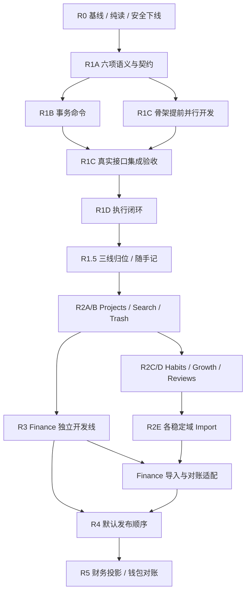

# Workbench vNext 开发计划

版本：v1.4 · 2026-09-18 · 语义封口与并行执行版，部分基础已实现、其余待实施

依据：[PRD](PRD_VNEXT.md) · [功能设计](FUNCTIONAL_DESIGN_VNEXT.md) · [Finance PRD](PERSONAL_WORKBENCH_FINANCE_PRD.md) · [架构记录](ARCHITECTURE.md)

## 1. 本次路线修订

保留悬赏板主流程，把旧“大 R1”拆为四个有独立退出门槛的阶段：语义成立 → 原子命令成立 → 前端骨架成立 → 主链可日用。现有生活、文字和奖励功能继续可用，全面归位与随手记完善放 R1.5，成长主页／N 维图／周月总结放 R2。默认先发布 Finance（R3），再发布 Agent Bridge（R4）；R2A/B 后 Finance 开发可与成长线并行。

采纳补充审阅中的纯读前移、Media 延迟物理删除、Segment、命令 owner、日期归属与轻量搜索建议。时间真值选择保留源记录权威：TimerSegment 拥有计时事实，手动 Actual Schedule 拥有补录事实，统一 ActualTime 读模型只聚合各来源一次；不再新增竞争性的可写时间账本。详见功能设计 4.1。

### 1.1 以新源码校正起点

- Task completion、Timer pause/finish 已在 `task-completion.ts` / `work-session.ts` 建立事务、投影身份与匹配重试；finish API 的 `completeTask` 默认 false。不能照旧评审文字当作全部缺失，R1A/B 复用后补 Segment、resume、跨日和单活跃执行。
- 当前已有 API workflow 测试、Web Vitest、feature 提取与 CI 相关改动。先验证现有设施，再补缺口，不重新选一套框架。当前工作区的未提交代码由原工作保留，本次只修改方案。
- Quick Notes 已有表／API／OpenAPI／奖励，前端只发现 CSS，未发现调用入口。需要恢复／补齐产品入口及可靠性，不能标为已交付完整页面。
- 当前同时存在 `V17__add_quick_notes.sql` 与 `V17__add_workflow_projection_identity.sql`，版本冲突是数据库迁移前置阻断项。旧 V2/V2_1 的生产记录也待核验；不未经调查重命名已部署迁移或 repair checksum。
- 现有类别 API 固定八个 dimensionKey，页面有能力分类与时长基础；N 维自由配置与成长角色页尚未实现。V1 的 `weekly_summaries` 未见对应 ORM，周期总结必须调查存量再迁移，不能复制第二套周报真值。

## 2. 发布门槛与可并行任务组

保留 R0 → R1A → R1B → R1C → R1D 的验收顺序。发布门槛是顺序关系，独立实现可以在冻结的契约上重叠进行；不能以 mock 通过代替真实接口集成。工作包 B00–B30 保留编号，子项仅拆职责，不另起路线。进度只记录待开始／进行中／阻断／待集成／已验收及证据，不估人日或按人力换算工期。

| 发布门槛 | 交付范围 | 必须已经通过 |
| --- | --- | --- |
| R0 | 数据／迁移核验、现有测试基线、纯读、Media 应用下线 | B00、B04a、B01a；DROP 的 B01b 独立控制 |
| R1A | 六项语义、schema／核心 DTO 与查询契约 | R0；B07a、B05a |
| R1B | 原子命令、operation receipts、slot 互斥 | R1A；B07b、B06a、B04b |
| R1C | Router、Query、核心 feature 与全局计时真实接通 | R1B；B02、B03a、B05b（可提前开发） |
| R1D | 首个可日用执行闭环 | R1B/C；B06b、B08、B12a |
| R1.5 | 既有功能归位、随手记、基础搜索／导出 | R1D；B03b、B09–B11、B29、B12b |
| R2A/B | Projects、已有域 Search/Export/Trash | R1.5；B13、B11b、B16a |
| R2C/D | Habits、成长角色页、N 维图、周月总结 | 对应源领域／Growth 契约稳定；B14、B30、B15 |
| R2E | 各领域受控导入与恢复 | 对应领域 schema／导出契约稳定；B16b，按域接入 |
| R3 | 完整 Finance 首版 | R2A/B 及 Finance 自身 B19–B22；不等待全部 R2E |
| R4 | Today + Tasks Agent Bridge | 核心事实／版本／幂等契约稳定；默认在 Finance 后发布 B17–B18 |
| R5 | 财务投影／外部钱包对账 | R3、Grant、外部钱包协议；B23–B24 |
| R6 | Inventory／完整 Calendar／项目里程碑／决策扩展 | 各自领域前置，不互相等待；B25–B28 |

### 2.1 并行编排表

“同组”表示完成该行启动条件后可以一起开发；表内箭头仍为组内串行依赖。每个组先指定一名集成负责人，最多三条独立开发线；更多包进入下一子批。这里只安排未来开发，不表示本次已启动这些任务。

| 组 | 启动条件 | 开发线 A | 开发线 B | 开发线 C | 集成／退出点 |
| --- | --- | --- | --- | --- | --- |
| G0 基线调查 | 当前工作区冻结基线 | B00a：部署／schema／Flyway／V17 冲突调查 | B00b：现有 invariant 与测试设施核验；DB 阻断时可先做不依赖 DB 的核验 | B01a 只读准备：Media 引用清单、下线补丁范围与备份方案 | 集成负责人确认迁移处理及可用隔离环境，才运行依赖 DB 的测试／改动 |
| G1 安全收口 | G0 数据／环境结论可用 | B04a：纯读／显式结转 | B01a：Media feature 与 route 下线 | B00b：纯读与旧闭环回归用例，独立测试文件 | dashboard.ts、app.ts、OpenAPI 重叠改动只由集成人合入；通过 R0。B01b 另走备份恢复门槛 |
| G2 核心契约 | R0 | B07a：六项语义、slot／Segment／快照／receipt／完成事件 schema 提案 | B05a：基于已冻结字段批次的 DTO／Query 契约，未冻结部分等待 | B00b 扩展：对应状态／并发／跨时区数据夹具与验收样例 | 单一负责人合并 schema、迁移、contracts/OpenAPI；通过 R1A 后才写依赖新模型的命令 |
| G3a 公共底座 | R1A | B07b-0：transaction-aware operation receipt 与 execution slot 公共能力 | B02：AppShell／Router／登录返回／既有入口；不写执行策略 | B03a：核心 feature 结构提取，复用原 public surface；App 接线交集交给 B02 owner | receipt／slot 公共 API 和 Query key 约定冻结；UI 可用受契约约束的 fixture，但不可算集成完成 |
| G3b 核心业务并行 | G3a 底座可调用 | B07b：pause/resume/finish/cancel 与 Task completion，统一事务／锁序 | B06a + B04b：接取／撤回／continuation 命令及公开事务能力 | B05b：API client／Query／核心查询消费／mini timer；等待 A/B 接口接通 | A 只在 B 的事务 API 稳定后接 acceptAndStart；单一集成人验证 R1B，再验证 R1C，不各自改奖励／锁规则 |
| G4 主链页面 | R1B/C | B06b：悬赏板／Task Detail／接取面板 | B08a：Timeline／Calendar 日周／手动 Actual 与更正 | B08b：Today composition／跨页 timer／Quick Add | B08a/b 是 B08 的 UI 职责拆分；B12a 汇总真实接口全链路与移动端验收，通过 R1D |
| G5a 归位与捕捉 | R1D | B09 + B03b：生活／文字页归位，公开日记草稿引用入口 | B29a：Quick Notes 记录／列表／编辑／奖励事务 | B10：Rewards/Insights/Tools 展示归位 | 三线各有 feature owner；路由／菜单／全局样式统一合入；不并发改同一奖励规则文件 |
| G5b 随手记联动与查找 | G5a 对应公开契约稳定 | B29b：转任务／引用草稿，依赖 B29a、B09、R1B | B11a：Settings、时区／显示／结转偏好 | B11b 基础：Search/Export 对已稳定域接入 | B12b 做 R1.5 集成；后续新增域只是扩展接入，不复制搜索／导出 owner |
| G6 项目与后续共用契约 | R1.5 | B13：Projects／Task 关联、历史快照使用 | B16a：通用回收站页面与已有域适配；项目适配等 A | B30a：GrowthDimension／目标版本与读 DTO 契约，不先做全图 | B11b 项目 Search/Export 在 A 契约稳定后接入；集成通过 R2A/B，冻结 Growth 和导出接入协议 |
| G7 成长与财务首批 | R2A/B + B30a | B14：Habit occurrence／目标规则／关联任务 | B30b：成长角色页、时间来源雷达／技能／里程碑；Habit 轴等待 A | B19：Finance 账户／分类／期初／基础账本 | Growth 先可用投入模式，Habit 适配接通后才算完整 R2D；Finance 独立功能标志与路由，不挡成长验收 |
| G8 周月总结与财务完善 | 对应上游公开契约稳定 | B15：Period Review 正文／快照／AI 草稿／转任务；按稳定 Growth、Habit 接口接入 | B20：Finance 转账／退款／冲正／并发 | B16b 基础：已稳定域导入与恢复；后加入的 Review/Finance 适配等待各 owner | A/B/C 可分别合入，不以全域导入阻塞周期总结或财务核心；对应里程碑各自验收 |
| G9 报表／数据与集成准备 | B20；R2D 对应源完成 | B21：预算／周期／财务报表 | B22：财务导入／对账，复用 B16b 的批次约定；与 A 重叠的 schema 串行合入 | B17：Grant／Today + Tasks 受限读取，可独立开发；默认待 R3 后发布 | B19–B22 验收组成 R3；B15/B16b/B30 对应功能分别收口 R2，不强制同一次发布 |
| G10 受控集成 | B17；财务投影还需 R3 | B18：Candidate／确认写入／审计 | B23：Finance Projection，独立敏感 scope | 外部 Wallet 契约／对账夹具准备；B24 实现等待 B23 与外部协议 | R4 完成后发布 R5；不让共享 Grant schema 两边各定义一版 |
| G11 独立扩展 | 各自前置达成 | B25 Inventory（R2；财务关联需 R3） | B26 Calendar（月／系列，需 B14） | B27 项目里程碑（需 B13/B15）→ B28 Decision 扩展（需 B10） | 可分批独立发布；B27 与 B28 可在空出的线独立进行，无业务串行依赖 |

R2A/B 后形成明确分叉：**成长线（Habits/Growth/Reviews）与财务线可以并行**，不用再等整个 R2E 才写 Finance。默认先完成用户主动提出的成长体验；如并行槽不足，先保成长线，财务线排下一批，不再为此重排整套路线。R1.5 收口时只核对当时的实际依赖与用户新优先级。

### 2.2 并行开发的共享边界

- 每个任务 brief 写清：输入契约／版本、owner、允许修改的文件、公开导出、依赖、验收命令、禁止触及的共享文件。依赖未满足标阻断，先做不依赖部分，不臆造第二套 API。
- 不同线优先独立 worktree／分支；若同目录协作，严格按文件 owner 分配。每线使用自己的测试库或隔离 fixture 范围，不能互相清理数据库。
- `db/schema.ts`、`db/migration/` 的编号、`docs/openapi.yaml`、contracts 公共导出、workspace manifests/lockfile、`App.tsx`/router/app.ts 接线、ARCHITECTURE 由当组集成负责人统一写入，其他线提交最小变更提案，不同时抢改。**同文件或同事务 owner 的改动按序合入，不叫并行。**
- 先冻结各线实际需要的最小契约，再并行开发。契约改变须通知全部消费者；集成负责人统一调整后重跑受影响验证。不会为了并行造 command bus、万能实体或大共享 store。
- 每线先通过自己的聚焦检查，合并后在同一集成版本运行跨域验收；mock／单线通过只表示待集成。R1B 的完整原子性和 R1D 的真实端到端链不能分线各自宣称已完成。

图中 Import → Finance 导入适配指共享批次协议可用，不要求所有 R2 域适配完成；R3 的基础账本、转账、预算不等待 Import。

## 3. R0：数据与语义安全基线

下一个建议任务：**`WB-R0-DATA-SEMANTICS-AUDIT-001`**，先调查，不开始新版 Today。

| 子阶段／工作包 | 具体交付 | 退出门槛 |
| --- | --- | --- |
| R0.1 / B00a | 记录工作区现状、部署代码版本、数据库 schema、Flyway history/checksum；计时／Schedule 可关联率、多活跃 Session、记录数量／汇总；随手记与旧周报存量 | 新库／已部署库差异有报告；重复 V17 的处理方案按真实部署决定；未查到生产 history 明确记阻断，不能猜 |
| R0.2 / B00b | 运行现有 API/Web 测试与必要检查，记录不变量、已通过案例和后续待实现案例 | 已有事务／重试／回滚用例在隔离测试库通过；测试缺环境必须报失败／阻断；不把 skip/TODO 算通过 |
| R0.3 / B04a | 所有业务 GET 移除写入；结转成为显式幂等命令，成长初始化迁至注册／显式修复；旧 Web 必要行为由明确命令触发 | Dashboard、Rewards 等聚合读不新增／更新业务行；重复结转只处理一次；打开历史无副作用 |
| R0.4 / B01a | 隐藏／移除 Media UI，停止调用与 API、聚合／OpenAPI 注册；应用脱离该表 | 无运行路径引用 Media；其他文字记录（尤其 Quick Notes）正常；此时允许表暂留 |
| R0.5 / B01b | 核验生产 history，备份并完成隔离恢复，新增前向 DROP 迁移，执行后清理闲置 ORM 映射 | 备份可恢复、当前应用不引用表、迁移版本唯一且发布窗口明确；未满足时延后物理删除，不提前删除表 |

B00b 先锁住已经存在的完成／终结事务和手动 Actual 行为。pause/resume 排除空档、跨日拆账、单活跃 Session 等尚未实现的不变量先写成明确场景与数据样例，在 R1A/B 实现后成为必须通过的自动化测试；不要求 R0 提前实现整套 Timer，也不允许用跳过测试伪装完成。

R0.3 的结转先抽出现有行为并保证命令幂等；“默认待续接、跨多天合并、不复制旧时钟位置”的目标语义在 B04b 单独切换，结构迁移与语义改动分开。

## 4. R1A–R1D：一次打穿执行闭环

### R1A — Domain Semantics

B07a 负责语义与持久化扩展，B05a 负责核心输入／输出契约、独立 Query API 与必要 version。依赖 R0，不依赖 Router 或其他页面全部提取。

- 明确 Task 长期状态与 Assignment 当日选择／结果；定义 Session / Segment、起止时间、取消／更正、单活跃 Session。
- 六项设计以功能设计 3.1–3.5、4.1 为冻结输入：Assignment continuation resolution；`user_execution_slots` 唯一用户行与锁序；user.timezone／recordTimezone／periodTimezone 快照；项目／类别发生时归属；reopen 后独立 Completion Event；一次动作一个 operationId／receipt。R1A 先固定字段与约束，R1B 再实现全部命令，不留给并行开发线临时自行选择。
- TimerSegment 为计时 canonical truth，Session 为工作流与来源；Schedule TIMER 为可重建投影；Manual/legacy Actual 为各自原始事实。统一 ActualTime 查询每个来源只纳入一次，规则不能各页面复制。
- 现有 `(userId, TIMER, sessionId)` 投影唯一约束只支持一 Session 一块；必须前向迁移为片段／日期切片身份，保留旧来源兼容，再启用 resume。不可只加 Segment 表后任由旧唯一约束阻止第二片段。
- 时间事实保存绝对时刻、记录时区与稳定 businessDate；跨日裁切使用原记录时区。Assignment/Journal 等日期实体保存显式业务日期与时区，不凭 UTC 午夜反推日期。详见功能设计 3.3。
- TimerSegment／手动 Actual 在 R1A 就带可空 `projectIdAtOccurrence` 与 `categoryIdAtOccurrence`；Projects 未上线时明确“当时无项目”，旧记录未知则另标未知。移动 Task 只影响未来片段；运行中变更归属先暂停。R2 不得按当前项目静默补改旧投入。
- 奖励账本正确性、幂等键、历史保留是 P0；角色页／商店改版与动效均不在这里。

**Exit gate：** 数据与状态图无双真值；迁移能在隔离存量副本和新库验证；暂停／跨日样例结果唯一可解释；Task/Timer 核心契约与 OpenAPI 对齐；已实现工作不回退。

### R1B — Transaction Workflows

B07b / B06a / B04b 在既有 `work-session.ts`、`task-completion.ts` 公共能力上补齐命令。一个用户原子动作由一个后端事务 owner 负责，前端不串联独立 API 去假装事务。

| 命令能力 | 事务 owner／范围 | 要求 |
| --- | --- | --- |
| acceptTaskForDate / releaseAssignment | Tasks / daily assignments | 日期唯一、排序／重点 revision；接取状态和 continuation resolution 独立 |
| acceptAndStartTask | Execution 应用工作流调用 Tasks 公开事务能力 | Assignment + Session + 首片段 + 必要 Task 状态全成或全败 |
| pause / resume | Execution | 关闭／开启片段与时间投影一致；暂停空档不计入 |
| finishCurrentSession | Execution + Rewards | 结束／汇总／投影／计时奖励同事务；默认不完成 Task |
| completeTask | Task completion | 每次真实 DONE transition 新建完成事件，首次奖励单独去重；直接完成不强制补录 |
| completeTaskAndFinishSession | Execution 调用 Task completion 公共能力 | 计时、完成与两类幂等奖励一致；不嵌套独立奖励事务 |
| carryOverAssignment / resolveContinuation | 显式结转工作流 | 源 Assignment 版本及 PENDING/DEFERRED 条件校验；源决定／目标接取同事务，保留忽略／撤回决定 |
| recordManualActual / correct / cancel | Calendar 或 Execution 按来源拥有 | 手动补录不默认完成；源更正与投影／奖励调整一致 |

这些是业务能力名，不要求新增八套资源或机械 CQRS。所有写命令使用功能设计 3.5 的 operationId／mutation_receipts，统一身份／fingerprint／结果回放，领域事务仍由各 owner 负责。开始前锁每用户 `user_execution_slots`；pause 保留 slot、finish/cancel 同事务释放。复用旧终结逻辑但不能继续把 `sessionId + action` 用作所有新动作的永久幂等键。

**Exit gate：** API/数据库测试证明重复提交、并发终结、断网响应丢失后重试无重复事实／奖励，事务中途失败整体回滚；AC-01–09 与 AC-26–33 的对应服务端场景通过。至少覆盖两次合法 resume 各自重试、reopen 再完成、忽略后不重现、slot 缺行／并发开始、跨时区／归属变更。后端可在无需新 UI 的情况下跑通同一链。

### R1C — App Shell

B02 / B03a / B05b 在 R1A 契约冻结后可与 R1B 并行开发；R1C 验收仍依赖 R1B 已通过且接通真实命令与查询。

- 引入真实 Router；只提取这次会修改的 Tasks / Assignments / Timer / Timeline / Today 协作表面，保留现有 Rewards、Decision Tools、Writing / Reflection public surface。
- 以 TanStack Query 管 current session、当日接取、Task detail、Timeline；Query key 含用户／日期／资源标识，mutation 明确 invalidation。mini timer 从同一服务端 Session 派生，不保存另一份运行状态。
- `packages/contracts` 只放实际共享的核心 schema/DTO，不含数据库和服务；配置 workspace 构建顺序，避免 Web import API 源码。具体库版本在实施时验证兼容。
- 顶层负责 session、导航、composition；表单草稿在 feature 内。不以“清理整个 App.tsx”作为发布门槛。
- 旧生活／文字／设置／商店页面通过可用过渡入口继续访问，只有已可用页面进入路由；不增加假占位页面。

**Exit gate：** 任务深链／刷新／浏览器前后退有效，Today 与详情／mini timer 状态一致，登录切换缓存隔离，同日后台刷新不覆盖草稿，旧入口仍可 CRUD。

### R1D — Execution Vertical Slice

B06b / B08 / B12a 完成 Today、悬赏板、Task Detail、跨页计时器、Timeline 日视图、Calendar 日／周、今日接取／待续接、Quick Add 任务／计划／补录。基本完成奖励反馈沿用，商店改版不阻塞。Journal 沿用可用入口完成链尾反思。

**Exit gate / 里程碑 `WB-EXECUTION-VERTICAL-SLICE-001`：**

1. 发布 → 接取 → 开始 → 暂停 → 恢复 → 结束本次（Task 未完成）→ 再次投入 → 完成 → 时间与奖励核对 → Journal。
2. 不计时直接完成、补录不完成、跨日、第二设备冲突、响应丢失重试、历史日期查询通过。
3. 375px 与 1440px 主要操作可用；加载／失败／空态和焦点基础可用；不存在假保存成功或重复奖励。
4. 只要求核心切片行为成立；不以随手记完整库、Search、Growth、全面设置、所有旧页面重写作为门槛。

## 5. R1.5：既有功能归位与随手记

依赖 R1D，完成后形成第二个可独立发布的版本。

| 工作包 | 交付 | 退出门槛 |
| --- | --- | --- |
| B03b / B09 | Sleep / Water / 晨写 / 日记 / 股票复盘归位；复用已提取 Writing / Reflection；各域历史 | 原记录数量与编辑能力保留；草稿保护 AC-10；移除万能 History 后仍能找到旧数据 |
| B10 | Rewards UI、兑换历史、Growth 过渡摘要、Insights / Decision Tools 二级入口与展示设置 | 账本不重写；新旧奖励策略明确；展示开关不改变事实；成长角色页留 R2 |
| B29a 随手记基础 | 复用 quick_notes；Quick Add／Today 轻入口／Journal 灵感库；分页／详情／编辑／标签；归档软删恢复；幂等创建与同事务奖励 | AC-13/16/17；保留 6 XP / 2 金币规则，编辑／恢复／导入不重发；旧硬删除与列表契约迁移明确 |
| B29b 随手记转行动 | 确认摘要→发布／发布并接取；来源关联；引用进 Journal 草稿 | 依赖 B29a 与 R1B；AC-14/15/18；每条笔记一个直接转换 Task；5000→2000 字不静默截断；个人文字不随 Task 授权被展开 |
| B11 | 设置：资料／类别／目标／外观／结转／展示；基础 Search（Task/Journal/QuickNote/Calendar）；分域导出 | 普通 SQL 查询与分页，不建统一索引平台；深链有效、导出可核对 |
| B12b | 归位回归、通用状态、键盘／触控、废弃兼容清理 | R1D 关键路径无回退，随手记闭环可用；只移除已无消费者的旧代码 |

Quick Notes 前端应有自己的 owner／public surface，不能为补入口把状态继续堆进 App 或塞入 Writing / Reflection 内部。

## 6. R2：Personal OS 与成长角色页

| 子阶段／工作包 | 交付 | 退出门槛 |
| --- | --- | --- |
| R2A / B13 Projects | 单项目归属、项目 CRUD／笔记／进度／计划与投入／归档；随手记可关联项目素材 | 项目→所属悬赏→接取计时→项目投入可核对，不复制 Task／QuickNote |
| R2B / B11b + B16a | Search 扩到 Projects；完善导出和统一回收站 | 已存在域完整可查可导出可恢复；未来 Habits/Reviews 交付时各自加入普通查询，无空索引框架 |
| R2C / B14 Habits | 定义／频率／目标生效版本、Occurrence、跳过与历史、专用记录投影、转今日悬赏 | 改规则不重写历史；每周 N 次正确；Water/晨写不双写；关联任务幂等 |
| R2D / B30 Growth | 英雄培养式 `/growth`、角色卡与现有 XP、可配置 N 维图／目标、技能卡、展示性里程碑／成长历程 | AC-19/20/24；新维度无需改枚举；投入与奖励不混算；多于 8 轴分组可读；每值可追源 |
| R2D / B15 Period Reviews | 周／月总结、相同口径对比、事实快照、个人正文、可选 AI 草稿、随手记引用、下一步转悬赏；项目／学习复盘 P1 | AC-21–23；周月区间无重叠统计；Growth/Journal 共用记录，AI 重生不覆盖正文；旧 weekly_summaries 迁移有核对 |
| R2E / B16b Import | 导入预览、批次去重、错误报告；跨域引用 ID 映射；恢复演练 | 源数据→导出→新环境导入，主对象数量／时间总量与来源关系核对；重试不重复 |

B30 的维度配置／投影先提供稳定读口径，B15 消费它；成长页的总结卡只链接 Review 公共入口，不能与 Review 形成相互等待的写入循环。基础规则摘要不依赖 AI 服务，角色展示不依赖昂贵美术资产。

## 7. R3–R6：财务先成立，再受控集成

| 阶段／工作包 | 交付与依赖 | 退出门槛 |
| --- | --- | --- |
| R3 / B19（FIN-01） | 账户、分类、期初、收入支出、账本、余额；R2A/B 后可与成长线并行 | 金额整数分，余额来自有效分录，无第二份手填真值 |
| R3 / B20（FIN-02） | 转账／退款／冲正／归档，依赖 B19 | 双边原子性、幂等、409 冲突；转账不计收入支出 |
| R3 / B21（FIN-03） | 预算、周期模板与待确认项、报表、Quick Add，依赖 B20 | 未确认周期不动余额；报表与流水一致 |
| R3 / B22（FIN-04） | 导入预览／去重、敏感导出、对账与审计，依赖 B20–21、B16b 的基础批次协议（不等待全部域导入） | Finance PRD 全部样例通过，恢复每账户余额一致 |
| R4 / B17 | 独立 Grant／scope／撤销、Today + Tasks 白名单读取，依赖 version 与 R1 纯读 | 不复用 Web token、不直连 DB；不能读随手记／周月总结／健康／财务 |
| R4 / B18 | Candidate 审阅、确认发布／接取、精确低风险授权、审计，依赖 B17 | 双次确认只一条 Task，冲突不覆盖用户状态，无角色判断字段混进事实 |
| R5 / B23（FIN-05） | 独立敏感 Finance Projection，依赖 R3、B17 | 普通 Today 授权无法读财务；过期／撤销立即阻止后续请求 |
| R5 / B24（FIN-06） | 外部 Wallet／Payment Effect 结果关联与对账，依赖 B23 和外部协议／环境 | 只有成功结果记账、来源 ID 幂等；待定不扣款；钱包执行不归 Workbench |
| R6 / B25 | Inventory：物品／位置／状态／保修／维护悬赏；依赖 R2，真实交易关联需 R3 | 物品价格不另改财务余额，维护历史可追溯 |
| R6 / B26 | Calendar 月视图、重复计划、提醒；依赖 R1D、B14 | 单次／系列分开修改，提醒失败不影响真值 |
| R6 / B27 | 项目里程碑、阶段目标与关联任务；依赖 B13、B15 | 不复制 Task 状态；与 B30 的个人展示性成就区分 |
| R6 / B28 | Decision Tools 比较／权重／事前风险／回顾；依赖 B10 | 转 Task 明确确认，不用万能实体混存 |

Activity Feed 与健康连接仍是后续机会项；Growth 的成长历程仅聚合明确相关成果，不等于现在建设全站通用事件平台。

## 8. 数据迁移与兼容

1. **先核验再编号。** 两个 V17 必须按实际部署历史决定前向修复或未部署文件重新分配；历史 V2/V2_1、V8、V17 不无依据改写。新版本从核验后的最大值分配。
2. **扩展后切换。** 来源、version、日期时区与 Segment 先兼容扩展，验证旧记录可读；唯一索引建立前审计重复。当前一 Session 一投影约束必须先升级才开放多片段。
3. **真实时间来源。** 已有 PAUSED 行是旧终结语义，不直接恢复为新会话；存量 RUNNING 和多运行项先让用户核对。可唯一证实才关联旧 Timer/Schedule；其余保留 legacy Actual，统计仅纳入一次，不猜测补写。
4. **保留记录。** Task/Assignment/QuickNote ID、内容和既有 reward event 不重建；QuickNote 从硬删除转软删除只保护未来删除，无法凭 schema 恢复已硬删正文。归档不级联删除投入和奖励。
5. **日期归属。** 回填旧记录使用已有业务日期与既定 Asia/Shanghai 语义，记录迁移依据；不可根据服务器当前时区重新归日。周月总结的期间、时区与确认快照稳定保存。
6. **成长与周期总结。** 现有固定维度映射到稳定 GrowthDimension 标识，停用保留历史；调整目标有生效版本；已有 weekly_summaries 核验后迁到唯一 Period Review 写入 owner，核对正文、周期和数量。
7. **API 兼容。** 旧 dashboard / timer / quick-notes 列表和删除语义有明确过渡窗口；现有 completeTask 字段继续复用；新客户端切换及消费者清理后再删除适配，不默改旧行为。
8. **回滚与 Media。** 应用仅回滚至兼容新 schema 的版本；数据优先前向修复。Media 先应用脱离再 DROP，物理删除前备份恢复验证，不能宣称代码回滚恢复已删数据。
9. **续接与完成历史。** 存量 Assignment 只在可证实情况下初始化已处理决定；来源未知时由明确迁移报告／用户处理，不因 GET 扫描改写。已知 completedAt 可迁一条标记为 legacy 的完成事件，不能虚构无法恢复的多次完成；已有奖励资格按旧 eventKey 保留，迁事件不补发奖励。
10. **执行槽与操作回执。** slot 回填前处理多活跃 Session；注册创建和缺行补建只能走写命令。新旧客户端切换期间统一锁序，旧适配也经过相同 slot；operationId 与 receipt 先落地再启用新命令，回执和业务同事务。迁移编号由当组集成负责人分配。

## 9. 验证与架构门槛

复用现有 API 数据库 workflow 测试和 Web Vitest。已有 CI 的不允许 skip 规则继续执行；新增尚未实现的场景以明确需求列表登记，不能把跳过当通过。每次非平凡代码变更运行 `npm run typecheck`、`npm run lint`、`npm run build` 及涉及 owner 的聚焦测试；lint 当前仍是 TS 检查。

| 边界 | 重点验证 | 首次强制通过 |
| --- | --- | --- |
| 现有事实与迁移 | 两类环境 history、重复版本、数量／汇总、备份恢复 | R0；物理删除另有 R0.5 门槛 |
| GET 与结转 | 业务表不写入、成长初始化不藏在读里、结转重试幂等 | R0.3 |
| 执行规则／事务 | Session/Segment、slot 并发、续接 resolution、记录时区／归属快照、再次完成事件、operationId 回放／参数冲突、回滚 | R1B |
| 核心前端 | 单远端状态、深链、草稿、全链操作、移动端 | R1C/D |
| 随手记 | 创建＋奖励原子、转换幂等、长文摘要、软删、引用草稿／隐私、分页 | R1.5 |
| 成长／总结 | N 维配置、同口径公式、来源去重、周月裁切／快照／修订、AI 非覆盖 | R2D |
| Finance | 双边转账／冲正、整数金额、导入与周期幂等、账户隔离 | R3 |
| Bridge | scope、白名单、撤销、候选确认、个人文字不因来源关联泄露 | R4–R5 |

每个退出门槛还须：契约变化同步 OpenAPI，schema 与 migration 一致，ownership 变化同次更新 ARCHITECTURE。简单 CRUD 保留 route-centric；只为实际跨域事务抽工作流；Web 与 API 仍只走 HTTP，共享 contracts 不得夹带 DB。Query 属服务器快照缓存，表单草稿留本 feature，Timeline/Growth/Search 均不能成为竞争性写入 owner。

本次是规划文档更新，不执行数据库修复、功能实现或生产发布；历史核验、测试通过与迁移部署不能以本文计划代替执行证据。

## 10. 需求与审阅追踪

| 需求／建议 | 落点 |
| --- | --- |
| 悬赏接取→计时→Timeline 主链 | PRD WB-01–05；R1A–D；WB-EXECUTION-VERTICAL-SLICE-001 |
| 原建议中的 IA／拆分／纯读／Contract | R0.3、R1C；B02–B05 分阶段落实 |
| Rewards 分账本正确性与展示 | R1A/B 与 R1.5；B07、B10，成长页 B30 |
| 随手记整合 | PRD WB-25；功能设计 2.9；B29、B11、B16 |
| 英雄培养式主页／N 维图 | PRD WB-26；功能设计 2.10；B30 |
| 周总结／月总结 | PRD WB-13；功能设计 2.11；B15 |
| R1 太大、容易相互等待 | R1A/B/C/D 独立退出门槛；现有功能归位移 R1.5 |
| 明确时间事实 owner 与 Segment | 功能设计 4.1、3.2；B07a，源真值与统一只读视图 |
| 原子用户动作由后端负责 | R1B 命令表；复用现有 workflow public contracts |
| 数据日期不随时区重新漂移 | 功能设计 3.3；B07a、迁移策略第 5 条 |
| Media 物理删除最后执行 | B01a/b；独立 R0.5 门槛，不挡安全解耦后的 R1 |
| Projects→Search/Trash→Habits→Reviews→Import | R2A–E；Growth 与 Reviews 合并为 R2D 的相关交付 |
| 原生财务早于外部集成 | R3 Finance、R4 Bridge；受限提前接入仅在后续明确调整时启用 |
| Finance Projection、Agent Wallet 分离 | R5；独立财务授权与外部执行 owner |
| Inventory、完整 Calendar、Decision、里程碑 | R6 B25–B28；不挤进核心切片 |
| 待续接处理状态 | 功能设计 3.4；R1A schema、R1B B04b／B06a；AC-26/27 |
| 单活跃 Session 串行化锚点 | 功能设计 3.2；user_execution_slots；AC-28 |
| 用户时区快照统一 | 功能设计 2.11、3.3；recordTimezone／periodTimezone；AC-25/29 |
| Project／Category 历史归属 | 功能设计 4.1；R1A 即固定 occurrence snapshot；AC-30 |
| reopen 后再次完成 | 功能设计 3.1；TaskCompletionEvent 与首次奖励资格分离；AC-31 |
| Mutation 身份统一 | 功能设计 3.5；operationId＋receipt 与业务唯一键共存；AC-32/33 |
| 去掉人日与安排可同步任务 | 本文 2.1 G0–G11 并行组、2.2 共享文件与集成约束；只保依赖与验收 |
