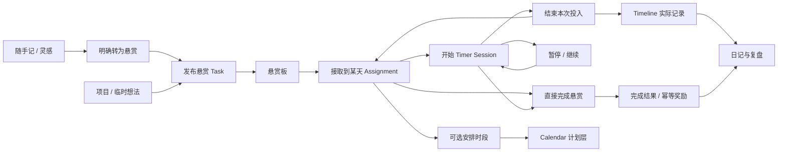
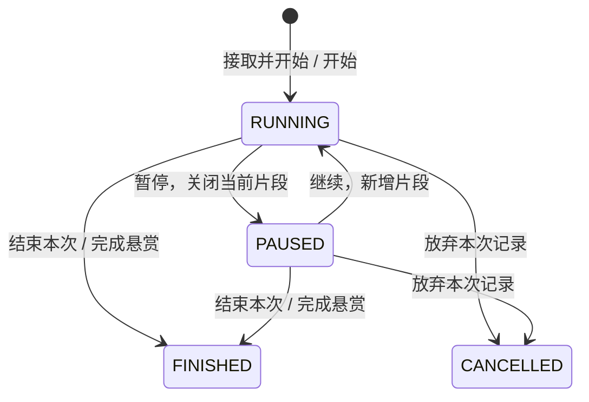

# Workbench vNext 功能设计方案

版本：v1.5 · 2026-09-21 · R2D0 后目标设计（Finance 优先、Hero/Familiar 分层）

配套：[PRD](PRD_VNEXT.md) · [开发计划](DEVELOPMENT_PLAN_VNEXT.md) · [架构记录](ARCHITECTURE.md)

## 1. 核心闭环



用户可以先接取再安排，也可以不排时间直接开始；不计时的小任务可以直接完成。QuickNote、Project、Habit 和 Agent Candidate 都只能通过任务领域的公开创建／接取能力加入闭环。随手记保存本身不启动计时、不生成计划／实际时段。

## 2. 页面与交互

### 2.1 Today：今日悬赏是执行中心

R2D0 后桌面以 **Sidebar + Main Execution + Utility Rail** 为稳定布局，不再把生活记录埋在主内容底部，也不让任务区域形成独立 nested scroll。

```text
┌─ Sidebar ─┬──────────────── Main Execution ───────────────┬──── Utility Rail ────┐
│ 今日      │ 日期 / 回到今天 / 搜索 / Quick Add          │ 喝水  当前/目标 [+1] │
│ 悬赏      │ 当前专注：第三章练习 00:24:10 [暂停][结束]  │ 睡眠  时长/质量 [编辑]│
│ 日历      │ 今日悬赏 / Top 3 / 已接取 / 已完成          │ 随手记 [记一条]      │
│ 项目      │ Task 列表自然增长，页面整体滚动              │ 启用的 Writing Slots │
│ ...       │ 今日摘要：完成 / 专注 / 实际投入            │ Habits / Timeline    │
└───────────┴───────────────────────────────────────────────┴──────────────────────┘
```

- Sidebar 展开约 140–160px，可折叠到约 56–64px；折叠偏好只存浏览器本地。
- Main 是最大的内容列，Task 列表自然增长；页面整体滚动，不用固定高度让 5–6 条普通 Task 立即出现内部滚动条。
- Utility Rail 约 300–340px；第一屏优先看见 Water、Sleep、QuickNote，之后是 enabled Writing Slots、Habits 与 Timeline。
- Water 是提醒／快速记录，不再放在页面底部；Sleep 可直接编辑；QuickNote 只提供轻量捕捉，不展开完整 Library。
- Today 仍只做 composition，不拥有 Water、Sleep、QuickNote、Writing、Habit 或 Timeline 的真值。

移动端保持固定五个 bottom tabs，并使用 **一个统一 Quick Action FAB** 打开 Bottom Sheet：

```text
生活快速记录：喝水 / 睡眠 / 随手记 / 已启用 Writing Slots
任务与时间：发布悬赏 / 安排计划 / 补录实际
```

不创建第二个 FAB，不让 bottom nav / MiniTimer 遮挡操作。

- 默认当天；历史日期显示“查看 9 月 16 日”，补录和日记可写历史，实时开始始终属于真实当前时间。
- 查看历史时点击开始，提示“将接取到今天并开始”，不伪造历史开始时间。
- 今日重点存在 Assignment 上，最多 3 个；Task pinned 仍表示长期重要，两者不相互覆盖。
- 无任务：显示“去接取悬赏”和“发布第一个悬赏”。全部完成：显示完成摘要和可选复盘入口。
- 跨页当前计时器固定；日期切换不改变活跃 Session。
- 移动 TaskCard 以标题、状态、紧凑 Category、主要执行动作与 More 为主；低价值 metadata 进入详情，44px 是 hit-area 约束而非视觉按钮尺寸。

### 2.2 悬赏板

页面主操作：“发布悬赏”。顶部视图：可接取 / 已接取 / 已完成 / 已归档；筛选支持 Inbox（未归项目）、项目、分类、优先级、截止日期／即将到期、关键词。默认展示未完成且未归档任务。

卡片信息按主次排列：

1. 标题与项目／类别，必要时显示逾期。
2. 进度、预计投入、截止日期；难度和奖励作为辅助信息。
3. 主按钮“接取到今天”；已接取显示“开始”或“继续”；运行中显示当前计时。
4. 更多操作：详情、编辑、安排时段、完成、归档。危险操作不挤在主按钮旁。

“接取悬赏”抽屉可以搜索、筛选、批量勾选，显示所选预计总时长；超过个人当天可用时间仅提示。建议每日 3 个重点，保留现有每次提交 30 项的保护上限，不能把 3 项做成强制任务总量上限。

发布表单只强制标题；分类可选“未分类”，默认中优先级／中难度；描述、项目、截止时间、预计分钟、初始进度都为展开项。提交按钮为“发布”和“发布并接取”；安排时段是可选项。创建 + 接取若作为组合操作提交，需同一事务，避免出现成功发布但用户误以为已接取。

任务详情包含：描述、状态、优先级、难度、类别、项目、截止日期时间、预计投入、进度、今日接取、计划时段、投入记录、完成说明、创建／更新／完成时间。桌面可抽屉打开但 URL 可直达；移动端为完整页面。

### 2.3 Calendar / Timeline

Timeline 是按日的统一视图，Calendar 是同一组计划和事实的日／周浏览器，两者复用同一统计与来源规则。

| 记录 | 展示 | 编辑入口 | 统计归属 |
| --- | --- | --- | --- |
| Planned Schedule | 虚线轮廓 + “计划”文字 | 日历编辑／拖动 | 计划时长 |
| Timer 产生的 Actual | 实色 + “计时”文字；关联悬赏 | 打开 Session 更正，不单独改投影 | 专注时长／实际投入 |
| 手动补录 Actual | 实色 + “补录”文字 | 编辑原补录 | 实际投入；不计入计时专注 |
| 当前运行片段 | 实时增长、标注“进行中” | 全局计时器 | 暂估值，已结算统计不纳入 |
| Sleep | 独立生活色层，可折叠 | Sleep 记录 | 睡眠统计 |
| Water / Habit 点事件 | 时间点、次数／数量 | 所属生活记录 | 生活统计，不占专注分钟 |

创建时先选“安排计划”或“补录实际”；录入起止日期时间、标题、可选任务／类别／说明。跨午夜使用完整起止日期，不以 `endTime < startTime` 猜测为次日。周视图允许查看、创建、编辑、移动计划；实际记录拖动需进入明确的更正流程。

计划生命周期：待执行 → 已执行 / 已取消 / 已改期。过期是时间推导的提示，不自动完成。实际投入可关联 `plannedScheduleId`；单次投入不自动宣告整个计划完成，用户在结束面板可勾选“本时段已执行”。任务完成也不把所有历史计划标成已执行。

计划重叠允许但提示。实际补录与已有投入重叠时先展示冲突，用户必须调整区间或明确“与现有记录重叠且不计入投入汇总”；后者仅为附注记录。睡眠与任务重叠只提示数据异常，生活与任务统计分开。

### 2.4 Projects

MVP 字段：名称、描述、状态、优先级、开始日期、目标日期、笔记、创建／更新时间、归档时间。Task 用可空 `projectId` 关联一个项目，暂不建立多对多关系表。

项目状态：PLANNING → ACTIVE ↔ PAUSED → DONE；任何非活跃执行状态可归档，归档支持恢复。结束项目时如有未完成悬赏，必须选“继续保留未完成任务”或“逐个处理”，不连带完成／删除任务。

项目详情：概览 / 悬赏 / 计划与投入 / 笔记。概览展示下一步、完成数量、目标日期、累计投入；可直接发布所属悬赏并接取。

项目进度按未归档任务的 `progressPercent` 等权平均，已完成计 100%，无任务显示“尚无任务”；分母变化可能使进度下降，界面可解释。项目 DONE 由用户确认，不由 100% 自动触发；累计投入从时间事实求和，不能把子任务耗时再重复相加。

项目投入按时间事实的 `projectIdAtOccurrence` 归属，不 join Task 当前 projectId 回推历史。例：9 月 Task A 在 X 投入 10h，10 月移到 Y 后，原 10h 仍属 X；之后的新片段才属 Y。类别使用同样的 occurrence snapshot。详细的片段切换、补录与旧数据处理见 4.1。

Project 本身不增加单一 `categoryId`。`TaskCategory` 表示跨 Project 的投入分类与可选 Growth mapping；“学习 / 实践 / 资料 / 实战”这类项目内部组织属于未来 `ProjectSection / Workstream`，不得拿全局 Category 替代。

R6 再考虑 ProjectSection / 里程碑（名称、目标日期、关联任务与完成条件），不加入甘特图、依赖图或 OKR 引擎。

### 2.5 Routines / Habits

Routines 保留现有 Sleep / Water 专用真值，并组合 Habits。Morning Writing 只有在对应 Writing Slot 启用时才从这里提供快捷入口；关闭 Slot 不影响历史正文或 Habit 对已保存晨写的只读达成判断。

R2 通用习惯支持：名称、是否启用、开始／结束日期、频率（每日／指定星期／每周 N 次）、记录模式（完成／次数／数量／分钟）、目标、单位、可选关联类别。历史按日／周显示达成、部分达成、跳过、未达成。跳过必须有明确状态，可写原因，不强迫补签。

- HabitDefinition 与生效日期明确的 HabitSchedule/HabitGoal 保存规则；HabitOccurrence 保存发生日和实际记录。修改频率只影响生效日后的计划，不重算过去的缺勤。
- 每日／指定星期习惯按应发生日算达成率；每周 N 次按周目标算，不虚构每天的未完成。
- Water 以专用记录为真值，习惯页从其累计数量派生；晨写以已保存的正文为达成依据，不另写一条独立打卡事实。
- Sleep 保存完整入睡／醒来时间，睡眠归属醒来日期；Timeline 按跨日片段显示，统计整晚时长一次。午睡／多段睡眠作为后续专用扩展，不塞通用 JSON。
- 可在某次习惯发生日“转为今日悬赏”，用 `(habitId, occurrenceDate)` 保证不重复生成；简单二元习惯可设置完成关联任务后达成，数量型以实际记录为准，二者不重复奖励。

### 2.6 Journal / Review

统一入口下按用户配置展示日记、晨间书写、股市复盘、随手记／灵感库、周期复盘和归档。按日期打开原领域记录，不强行合表；随手记在导航上归入此处，但有独立 QuickNote 数据与前端 owner，不塞入已有 Writing / Reflection 的三类草稿。

Writing Slot 只控制 **主入口是否出现与排序**，不拥有正文。目标默认策略为：新用户 `MORNING_WRITING`、`JOURNAL`、`STOCK_REVIEW` 全部 disabled，由 Settings 显式 opt-in；既有用户的偏好和历史记录不通过迁移强改。关闭 Slot 后，History / Search / Export 仍可访问历史，重新开启后恢复主入口。

- 日记保留自由文字、开心的事、成果、学习、明日重点、心情；今日任务与时间摘要以可引用卡片显示。
- 晨写保持 daily ritual；正文由用户保存，Habit 只读达成状态。
- 股票复盘保留现有字段，进入“复盘 → 股票复盘”；内容不产生 Finance 流水。
- R2 增加周复盘、项目复盘、学习复盘固定表单：期间／对象、成果、问题、下一步；投资复盘复用已有股票入口。先提供预设类型，不做任意表单设计器。
- 引用的摘要默认是动态来源链接；写入复盘正文时形成用户确认的文本快照，后来源记录变化不偷偷改正文。
- 初期显式保存 + 离开提醒 + 本设备恢复草稿。后台刷新不得覆盖未保存内容；保存遇到版本冲突提供比较与重新载入。
- 历史回归 Journal Archive；搜索结果直接打开对应日期／记录，不保留万能 History 一级页面。

### 2.7 Rewards / Growth / Insights / Tools

悬赏仍有“努力被记录”的反馈：卡片展示预计奖励，完成后显示实际奖励和简短反馈；支持减少动效和隐藏数字。R1.5 在 More 保留成长摘要，R2 等级与能力图升级为“我的成长”独立个人主页（2.10）；Reward Shop 与兑换历史仍在 More。

- 保留任务难度与重要标记对应的既有奖励公式，R0 将当前数值固化为回归样例；卡片与后端共用同一规则，标明“预计”。
- 完成奖励按 `taskId` 首次完成发放一次；重新打开再完成不重复领取。任务重复事项应建立新 Task／Habit occurrence。
- 暂停不再发任务阶段奖励；结束 Session 按净投入结算一次计时奖励（沿用当前每完整 25 分钟 5 XP / 1 金币的规则）。旧奖励不追扣；新旧策略记录生效版本。
- 结束 Session 并完成任务可以得到计时与任务完成两种不同奖励，各自仅一次。直接完成只发任务完成奖励，未计时不补造时长。
- 更正已结算时长需追加有来源的奖励调整，不能直接改历史 event；扣减导致余额不足时保留调整并暂停新兑换，直到可用余额恢复。历史余额不得静默归零。
- 关闭“展示”不改变奖励流水；若未来需要关闭“发放”则另立设置，不混成同一开关。
- 能力维度路径是 Task → Category → Dimension；累计目标是统计分类，不改变任务生命周期。
- Insights 展示周／月投入、完成、睡眠、习惯；AI 输出标记生成时间、来源范围与“分析建议”，可删除／重生成；不覆盖源事实。
- Decision Tools 独立维护决策记录；结果可通过明确操作“创建悬赏”，不自行修改 Task。后续增加加权决策、事前推演、结果回顾。

### 2.8 Search / Quick Add / Settings / Data

R1.5 的 Search 首版基于各域普通数据库查询：关键词、类型、日期、分页；任务查标题／描述，文字记录查正文，随手记查标题／正文／单标签，日历查标题／备注。限定当前用户、排除删除记录，返回类型、摘要和深链。R2 纳入 Projects、Habits、Reviews，R3 才接入 Finance，财务结果默认隐藏金额直到展开。

移动端与桌面的快速新增继续作为 **一个 launcher**，调用各域 API，不创建 Universal Workbench Item。当前包含任务、计划、实际补录、Water、Sleep、QuickNote 与 enabled Writing Slots；R3 Finance 上线后增加“记一笔支出/收入”，仍复用同一个 Quick Action FAB / Bottom Sheet，不另建财务浮动入口。随手记保持“先记下来”，不先问是否转任务。

Settings：资料、任务分类、Writing Slots、习惯目标、奖励展示／规则说明、外观、结转偏好、集成、数据。

- 新用户默认 Task Category 为 `工作 / 学习 / 创作 / 生活 / 健康 / 社交 / 其他`；不默认创建 Stock / Investment 类别。
- Category 管理必须有明显的 `+ 新增分类`；Task 创建/编辑的 Category selector 底部也提供 inline create，成功后自动选中。
- Category 支持预设色板 + 自定义 color picker / Hex；颜色只是 presentation metadata，不参与身份、权限、历史归属或 Growth 计算。
- Category → GrowthDimension 映射可空；`暂不映射` 是一等状态。
- 分类停用不删除历史投入；原分类名／颜色作为历史快照保留。
- Writing Slots 在“文字与复盘”设置中独立启用/关闭/排序；关闭不删除正文。


Data：分域 JSON / CSV 导出，文字额外支持 Markdown；敏感导出由用户主动操作。R2 导入先预览、校验、报告重复／失败行，再以批次键提交；不能因一行错误悄悄丢其他数据。备份恢复先做独立环境演练，回收站与数据库备份不是同一能力。

### 2.9 随手记／灵感库

**定位：随时捕捉尚未整理的想法、片段和行动线索。** 一天可以有多条；日记是按日的反思，Task 是行动承诺，QuickNote 保存原始记录。灵感库是 Writing 的整理入口：`writing_inspirations` 只保存收藏、置顶、归档等用户级元数据，正文、标题、日期和项目关系继续由 `quick_notes` 作为唯一事实源；不引入通用 `InspirationCategory`。

当前已交付：Quick Notes 已有独立 Web owner、列表／详情／编辑、cursor pagination、关键词/日期/标签筛选、archive、recoverable delete/restore、幂等创建与同事务奖励；每条手工新建记录仍为 6 XP / 2 金币。Note→Task 转换、Journal 草稿引用、Project 素材关联、Search/Export/Trash 已接入；Task/Project DTO 不反向展开私人正文。后续 R2E 只补通用导入，不重做捕捉与生命周期。

#### 入口与记录

- 桌面全局 Quick Add、Today 轻入口、移动端快速新增都可打开同一个随手记 feature 的输入表面；导航归于“日记与复盘 → 随手记／灵感库”，路由 `/notes`、`/notes/:noteId` 和 `/inspirations`，不占新一级 Tab。QuickNote 详情通过显式“加入灵感库”进入 Writing owner。
- 先输入正文即可保存；标题和单标签可选，标题为空时列表显示正文首行摘要，不把派生摘要强行写回标题。
- 全局新增默认真实今天；从历史日期的 Journal／Today 新增时，表单明确显示并允许修改“记录日期”，保存真实 createdAt，不能把历史日期伪装成捕捉时刻。
- 成功后确认已保存并提供“查看”“转为悬赏”；失败保留正文和同一提交键。草稿属于 Quick Notes feature，切换页面／日期前提醒或保留按用户隔离的本设备草稿，退出登录不暴露给下一用户。
- 灵感库默认按更新时间倒序；支持标题/正文/标签搜索、未打标签、收藏、置顶、归档和多标签 AND；标签经过 NFKC、空白折叠和大小写无关规范化，不扫描正文 hashtag，不引入隐式分类。归档不等于已转任务。
- 编辑使用 version 检查，冲突保留草稿。归档／取消归档只改变整理状态；删除进入回收站，恢复不重复奖励。R1.5 提供最小恢复入口，R2 再归入统一 Data 页面。

#### 从想法进入悬赏闭环

1. 点击“转为悬赏”，预填标题与描述，由用户确认。随手记最长 5,000 字而 Task 描述上限 2,000 字，必须提供摘要编辑与字数提示，不能静默截断；原文通过来源链接保留。
2. 可选分类、难度、预估投入、截止时间；项目字段随 R2 Projects 上线。主按钮为“发布悬赏”与“发布并接取”，不自动启动计时。
3. R1.5 每条随手记最多一个直接转出的 Task；保存来源关联。再次点击展示“查看关联悬赏”，双击／重试不创建第二条。后续确需拆为多个行动时再增加显式拆分能力。
4. 转换由具名的应用工作流协调 Quick Notes 与 Tasks 的公开能力；创建 Task、可选 Assignment、来源关联在一个事务中提交。不得从随手记 route 导入 Tasks route 的私有 handler，也不得扩展 App.tsx 为新的业务 owner。
5. 原 QuickNote 保留，Task 是确认时的行动摘要快照。之后修改任一方不自动改另一方；关联任务已归档／删除时显示状态，不自动重建；删除随手记不级联删除任务、时间和奖励，关联入口显示来源已删除。

“引用到日记”把用户选中的文字和来源链接插入目标日期的日记草稿，用户保存后才成为日记内容；不得覆盖已有正文或强行保存未确认草稿。按 `(noteId, journalDate)` 检测已有引用并提示，不因重复点击插入重复文字。日记保存失败不改变随手记；已保存的引用文本不随原文修改／删除自动消失。

R2 可关联所属项目作为项目素材，保持 `projectId` 可空且单归属，不另复制项目笔记真值；关联项目不等于发布任务。

#### 奖励、隐私与数据

- R1.5 沿用每条新建记录 6 XP / 2 金币，先修复创建命令幂等：同一提交键只插入一条 QuickNote，并在同一事务发奖。当前 reward event key 只防同一个 ID 重复发奖，无法防创建请求重试生成多个 ID，此处必须补齐。
- 编辑、归档、恢复、引用和转任务不再发“记录随手记”奖励；后来完成转出的任务按任务奖励规则单独结算。删除不追扣既有记录奖励，也不能通过恢复重新领取；批量导入历史记录不发奖励。新的不同手动记录仍按当前规则发放，暂不另加限额策略。
- 随手记不增加专注分钟、不完成习惯，不自动向 Timeline 写占用时段。若未来展示捕捉事件，也只能作为可选点事件，不参与耗时统计。
- 纳入 R1.5 Search 与 JSON/CSV/Markdown 导出，保留正文、单标签、noteDate、createdAt、归档状态和关联标识；R2 导入按批次来源键去重，恢复时旧 ID 需映射到新环境 ID。
- 按个人文字处理，Bridge v1 的 Today/Tasks 投影排除随手记正文、摘要和标签，不因 Task 关联就展开原记录。用户确认写入 Task 的摘要适用 Task 权限；转换面板提示哪些文字将成为任务内容。日记引用亦遵从目标领域权限，未来 AI 分析原文需用户显式选择。

目标补齐接口：`GET /api/quick-notes/:id`、`PUT /api/quick-notes/:id`、归档／恢复命令、`POST /api/quick-notes/:id/convert-to-task`；扩展列表为分页、关键词／日期范围／标签筛选。原 GET 返回数组的客户端需兼容过渡，详情、mutation 和 pagination 契约落地时同步 OpenAPI。DELETE 从当前硬删除改为可恢复删除，需要明确契约变更；旧表 `deletedAt` 可复用，新增 version、archivedAt、稳定转换关联等使用前向迁移，不改已部署 V17 历史。

### 2.10 我的成长：英雄培养式个人主页

**用户看到的是“我这个角色正在成长”。** `/growth` 提供长期个人档案，桌面独立入口、移动端头像／更多置顶直达；Today 只留等级小标和本周回顾入口。成长页不承载商店编辑、所有记录表单或聊天。

```text
┌ 我的成长 ─────────────────────── [本周] [本月] [累计] ┐
│ 头像 / 展示名 / 个性签名       Lv.12   XP 进度        │
│ 当前称号：持续探索者           本期新增 XP / 投入      │
├────────────────────────┬───────────────────────────┤
│ N 维成长雷达            │ 当前培养方向               │
│ 本期实线 / 上期虚线     │ 学习：完成第三章练习 [接取] │
│ [目标达成] [累计投入]   │ 运动：本周 2/3 次           │
├────────────────────────┴───────────────────────────┤
│ 技能卡：韩语 23/100h · 编程 46/100h · 写作 12/50h    │
│ 里程碑：首次 10h / 项目完成 / 连续记录（可隐藏）      │
│ 成长历程：项目成果、已确认总结、个人感悟               │
│ [本周总结] [本月总结] [查看历次回顾]                  │
└────────────────────────────────────────────────────┘
```

布局示意中的数值与称号是设计样例，不代表用户真实数据。R2 先使用预设头像／色彩和可编辑个人介绍；不以 3D 模型、复杂装备系统或素材制作阻塞功能。视觉保持现有薄荷／粉色主题，可选轻量升级动效与 reduced motion。

#### N 维与技能

- 复用现有 career、creative、learning、life、body、social、leisure、foundation 作为初始维度，名称可编辑、可新增、排序、停用。维度数量 N 不再由 TypeScript／Zod 固定枚举决定。
- 模型仍为 Task → Category → GrowthDimension；一类任务只归一个主维度。Category 同时作为技能卡的基础，例如韩语、编程；首版不再创建一套重复的 Skill 实体或技能树。
- Habit 可显式关联一个维度，以应发生目标达成率作为该维度的可选统计来源；不通过匹配记录文本或 AI 猜测归属。Sleep / Water 等沿用专用事实，仅显示明确配置的目标达成，不把睡得更多视为能力更高。
- N 个维度都能配置和列表展示。雷达单次显示用户选定的 3–8 个维度；不足 3 个改用进度卡，超过 8 个分组／切换并提供完整列表，避免多轴挤到不可读。图表提供文字表格、数值和键盘可达的维度详情。
- 点击维度进入明细：本期与累计投入、关联分类／习惯、任务成果、目标、计算说明和来源记录；可选“培养方向”筛选该维度悬赏并接取。

#### 成长数值规则

| 呈现 | 口径 | 与奖励的关系 |
| --- | --- | --- |
| 全局等级与 XP | 复用现有 rewards ledger 与等级公式，周期新增 XP 使用事件入账时间 | 不建立另一份可编辑 XP；随手记奖励可增加全局 XP |
| 累计投入模式 | 轴值 = min(100, 有效累计分钟 / 用户设置的该维度阶段分钟目标 × 100)；实际小时和超额另显示 | 时间来自规范化 Actual 集合，不能把 XP 换算成投入；目标未设显示“未设目标” |
| 周／月目标达成模式 | 默认按该维度本期投入分钟 / 本期分钟目标；可改为一个明确习惯的本期达成份额，均封顶 100 | 首版每个维度只选择一种计量来源，不混合任意权重；来源、单位、目标在图旁可查 |
| 技能进度 | Category 有效累计分钟 / 该类别目标（沿用 100h 或用户自定义） | 超目标保留真实累计；不自动改大目标导致进度下降 |
| 里程碑／称号 | 首版固定规则：投入达到指定小时、完成项目、完成若干周月回顾；显示达成证据与日期 | 首版是展示性成就，不附加另一套重复 XP／金币；唯一用户＋规则＋目标来源防重复 |

0 条已记录活动与来源不可用不同：前者显示“本期未记录”，后者显示“数据暂不可用”；未设目标不填假 0 分。维度只是记录和培养方向，不宣称测量智力、健康或人格水平。没有任何周／月活动不扣 XP、不降低等级。

维度与目标配置按生效日期保留版本；当前修改不能悄悄重写已确认总结。图表上期对比默认按本期同一目标／映射口径重算两期，并标为“按当前目标比较”；上期原目标与原结果在历史总结查看。累计轴目标变更时提示显示尺度改变，不能把图形缩小解释为退步。

#### 成长历程与归属

成长页聚合 Task／Project 完成、技能里程碑、已确认周期总结；用户可把随手记标为“成长感悟”展示来源链接，原记录仍归 Quick Notes。不是所有私密随手记都自动出现在成长主页。个人档案默认私有，分享页／公开排名不纳入 R2。

Growth 拥有维度、目标配置、个人展示偏好与派生统计；Rewards 继续拥有 XP／金币和结算。记录来源删除／更正后成长聚合可重算；里程碑证据不再成立时标记已调整，不能保留一条无法解释的有效成就。人工更改个人介绍不影响成长数据。

### 2.11 周总结与月总结

成长页和 Journal 的“周总结／月总结”打开同一份 Period Review，不各存一份文本。周期分周（周一 00:00 至下周一 00:00）和自然月（1 日至下月 1 日），按该 Review 的 `periodTimezone` 计算边界，区间均左闭右开。periodTimezone 创建时从 user.timezone 拍快照，默认 Asia/Shanghai；不是永久使用上海日界。

| 区块 | 展示内容 |
| --- | --- |
| 事实摘要 | 完成悬赏数、计时专注／补录投入、项目推进、技能投入、习惯达成；随手记与日记数量单列 |
| 成长变化 | 新增 XP／里程碑、维度与技能变化、投入分布；选中相同维度和口径再比较 |
| 重要时刻 | 用户挑选已完成悬赏、项目成果和随手记片段，带来源深链 |
| 我的复盘 | 最满意的事、困难与原因、学到什么、需要调整什么、下阶段重点，自由文本可选 |
| 下一步 | 用户确认后逐条发布悬赏／接取到选定日期；不因生成总结自动建立任务 |

- 本周／本月可以随时查看“进行中”事实预览；周期结束后展示“待复盘”。无数据时允许只写个人文字，不生成虚构成果或强制补齐。
- 月总结直接按自然月查询源事实，不能直接把周报加总（跨月周会重复／遗漏）；周报正文只可作为用户选择的参考材料。
- 完整周期可与上一完整周期比较，月天数差异同时显示日均。进行中周期只比较上一周期相同已过天数／时刻，样本不足明确标注；不把半周与完整周比较后称作下降。
- 保存前事实摘要实时可重算，正文是独立草稿。首次确认后保存事实快照、维度／目标版本、生成时间与用户正文；更正源数据时标“来源已有变化”，用户可刷新事实快照并保留正文与历史修订。
- 状态为草稿／已确认／已归档，唯一 `(userId, periodType, periodStart)`；periodStart 是该记录时区下的业务日期。首次显式保存冻结 periodTimezone 及对应 UTC 起止边界，GET 预览不落库；已有周期始终返回其快照，不因修改偏好再创建第二份。同一周期从 Growth 和 Journal 打开的是同一记录，版本更新防覆盖。
- 周期内真实时间按 Review 的 UTC 边界裁切源区间，计入项目／类别时沿用源 attribution snapshot；这是固定报表视角，不回写源 businessDate。日记／随手记／习惯等日期型事实按明确的业务日期纳入并保留来源时区，不伪造午夜时刻。跨时区时明细注明两种口径，不以时间区间筛日期型记录；再次生成同一 Review 始终沿用其已固定的边界。
- 基础事实摘要由确定性规则产生，不需要 AI。用户可选择用哪些事实与文字生成 AI 建议草稿；生成失败仍能编辑保存。重复生成只替换 AI 草稿，不能覆盖已写正文或自动标为已确认。
- 随手记引用遵循 2.9 的草稿与来源规则；每条行动建议使用稳定来源关联／幂等键，重复点击只创建一个 Task。总结创建／刷新不额外发金币；“完成回顾”的展示性里程碑去重。
- 周月总结全文支持搜索与 Markdown 导出，权限按个人文字处理，Bridge v1 不包含它们；成长聚合也不借普通 Tasks scope 外露习惯／睡眠等数据。

数据落点：Journal / Review 拥有周期正文、事实快照和修订，Growth / Insights 提供事实投影。已有 `weekly_summaries` 先核验数据与部署状态，再以前向迁移归并／扩展到周月共同的 Period Review；迁移后只保留一个写入 owner，不能新建月报同时遗留另一份活跃周报正文。

目标接口：纯读 `/api/growth/profile`、`/api/growth/summary?period=&start=`；维度／目标配置接口；`/api/period-reviews` 查询、保存、确认和版本化更新；AI 草稿生成与下一步转任务为显式 POST。具体契约在 B30 / B15 落地时更新 OpenAPI，聚合 GET 不顺手补发成就或初始化账本。

### 2.12 Finance：真实财务真值域

Finance 的完整设计以 `PERSONAL_WORKBENCH_FINANCE_PRD.md` 为准。当前路线中它在剩余 Growth / AI 之前交付。

- FinanceAccount / Transaction / Entry 是独立核心域；余额从有效 Entry 派生，不维护第二份可手填余额。
- Workbench Coins、Finance Money、Agent Wallet 永久分账。
- 移动快速记账接入现有统一 Quick Action FAB，不能再建第二个浮动入口。
- 财务 Search 在 R3 接入现有 Search owner；默认结果隐藏金额直到用户展开。
- Finance 导入由 FIN-04 自己拥有 FinanceImportBatch / source-row identity，不等待通用 R2E Import 平台。
- Finance 事实之后可供 Review / AI 以最小投影消费，但普通 Today/Tasks 授权与内部 AI 都不得隐式获得敏感财务全文。

### 2.13 Internal AI / 指引魔法使 Familiar

Workbench 内部 AI 与 R4 Agent Bridge 是两条不同能力：

- **Internal AI**：帮助用户理解自己的文字与事实，呈现为指引魔法使 Familiar。
- **Agent Bridge**：让外部 Agent 以 Grant / scope 受控读取和提交候选动作。

AI 的稳定原则：

```text
业务事实 → deterministic query / code
        → 最小 Context Builder
        → Jev（仅在需要判断/分类/筛选时）
        → cheap LLM（梳理/生成）
        → reasoning LLM（复杂决策，用户主动）
        → AI Artifact
        → 用户确认
        → Domain Owner
```

#### 成本层

| Tier | 手段 | 负责 |
| --- | --- | --- |
| 0 | SQL / Code / Template | 统计、金额、日期、完成率、固定日报；不调用 AI |
| 1 | Jev | actionable 判断、分类、筛选、routing、是否升级模型 |
| 2 | Cheap generative LLM | 晨写梳理、日记主题、Task 候选、短解释 |
| 3 | Reasoning LLM | 心理桥梁、复杂决策、深度复盘；默认用户主动触发 |

Jev 不是日报引擎，也不用于算术、日期比较或账本计算。确定性事实一律由代码提供。

#### AI Artifact

AI 输出保存为可删除／可重生的派生物，至少记录：

- artifactType
- source refs + source versions
- generatedAt
- provider / model
- promptVersion
- token / cost metadata
- stale 状态
- result payload

源正文修改后 artifact 可标 stale；不会修改或覆盖 Journal / Morning Writing / Task / Finance 原记录。

#### 第一批 AI 能力

1. Morning Writing → 整理思绪、今日关注、行动候选。
2. Journal Insight → 主题、反复出现的念头、与近 7/30 天的联系、变化证据。
3. Text → Task candidates → 只生成候选，用户确认后调用 Tasks public capability。
4. Psychological Bridge → 把混杂感受拆成事实/担忧/冲突/真正问题/下一步。
5. Decision Assistant → 重构问题、生成选项、criteria、Jev/code 评分、LLM trade-off / premortem。
6. Weekly Review AI → 只解释确定性事实与精选文字，不让模型重新计算统计。
7. Project Copilot / Ask My Workbench / Stuck Insight → 通过最小查询与检索读取相关事实，不把整库塞进 prompt。

#### Familiar presentation

Familiar 是 AI 的统一 UI 人格，不是业务 owner。第一版状态由本地事件驱动：

`IDLE / THINKING / WRITING / CELEBRATING / SLEEPING / WAITING`

角色动画本身不调用模型。视觉遵循 **Modern Productivity Core + Pixel Fantasy Skin**：角色、Icon、Badge、Progress、Empty State 像素化；编辑器、表单、日期控件与长文本保持现代可用性。


## 3. 生命周期与异常规则

### 3.1 Task / Assignment

| 对象 | 状态与动作 | 规则 |
| --- | --- | --- |
| Task | TODO → IN_PROGRESS → DONE；TODO 可直接 DONE | 开始计时进入 IN_PROGRESS；暂停／结束本次不完成 Task |
| Task 重新打开 | DONE → TODO / IN_PROGRESS | 用户指定进度（默认 0%）；保留既有投入、完成事件与奖励，不重复发完成奖励 |
| Task 归档 | TODO / IN_PROGRESS / DONE → ARCHIVED | 有未结束 Session 时需先处理；保存归档前状态以便恢复 |
| Assignment | ACCEPTED → RELEASED；可再接取 | 唯一 `(userId, taskId, taskDate)`，恢复原记录不重复插入；释放仅撤回当天安排 |
| Assignment 当日结果 | 未开始／有投入／当日完成 | 投入由该日事实派生；当日完成保存日期明确的完成结果，不用 Task 当前状态回推过去 |

Task 当前状态与完成历史分开。每一次从非 DONE 实际转为 DONE 都新增 `TaskCompletionEvent`（taskId、occurredAt、recordTimezone、businessDate、operationId、生命周期版本）；重复请求或已经 DONE 时的无变更调用不新增事件。`completedAt` 表示当前这次完成：重新打开时清空，旧事件保留，重新完成写新时间；reopen 自身也记录审计。首次完成资格按 taskId 消费一次，奖励仍由 Rewards 去重。

例如 9/10 完成 → 9/11 重新打开 → 9/14 完成，会有两次完成事件、一份首次完成奖励。周期统计按事件筛区间后对 taskId 去重，所以同一周最多记一个已完成任务；不同周各有真实完成则各计一次。当日结果按对应完成事件归日，reopen 不擦除此前已发生的结果。

跨多日 Task 可有多个 Assignment。完成只更新完成发生日的有效接取结果；昨日“有投入未完成”保持不变。未接取直接完成时，可原子创建当日 Assignment 使今日统计可解释；历史补登记完成需用户明确选择完成日期。

撤回有历史投入的 Assignment 不删时间事实：Today 折叠到“已撤回但有投入”。日完成率分母排除纯撤回项，但保留已经开始或完成后撤回的项，避免通过移除任务美化统计。

### 3.2 Timer 状态机



Session 下有若干 TimerSegment，每段记录真实起止时刻。暂停关闭片段并写入 Timeline；继续开启新片段；净投入为片段时长总和。FINISHED 不可 resume，再开始会创建新 Session。

“结束本次”面板展示净投入、实际片段、可选进度／备注，默认任务继续；另有明确按钮“完成悬赏并结束”。完成处不再强制填写起止时间；补录是独立可选项。

同一用户最多一个 RUNNING 或 PAUSED Session。**锁定实现选择独立 `user_execution_slots` 行**：userId 为主键、activeSessionId 可空；存量用户前向迁移回填，新用户注册时创建。命令遇到缺行只能在写事务中按主键幂等补行并锁定，GET 不补行。开始前 `SELECT ... FOR UPDATE` 锁该用户 slot，再检查 activeSessionId、创建 Session／首片段、更新 slot，并与接取及 Task 状态同事务提交。

暂停保留 slot；恢复必须验证 slot 指向当前 Session；finish/cancel 同事务清空 slot。任何修改执行状态的路径（包括完成并结束、修复命令）都用这一锚点，不能仅查询 timer_sessions 中有无 RUNNING。slot 与 Session 不一致时返回可识别冲突、走显式修复，不自动清空后再开始。既有多个活跃 Session 先在迁移核验中收口，再启用约束。

执行类命令锁顺序统一为 operation receipt → 用户 slot → Task（按 ID）→ Session/Segment → Assignment／continuation → Reward；直接 Task 完成也遵守相关顺序，不能与 complete-and-finish 逆序抢锁。第二设备拿到冲突时显示当前任务并跳转；同一 operationId 重试返回原提交结果，另一次用户动作使用新 operationId。

取消是“放弃本次记录”，二次确认后 Session 与其时间投影作废，不发计时奖励，任务保留未完成；结束并保留记录无需走取消。已经 FINISHED 的记录走更正／软删除，不倒退 Session 状态。

### 3.3 日期、补录、失败

**统一选择用户时区快照模型。** `user.timezone` 是新记录的默认 IANA 时区，初始 Asia/Shanghai，Settings 可手动更改；不根据设备或定位自动切换。TimerSession 保存 recordTimezone，Assignment、Journal、QuickNote 保存 timezone context，PeriodReview 保存 periodTimezone。真实时间记录保存 UTC 语义的绝对起止时刻及 businessDate／切片日期；Session 的 recordTimezone 在一次会话内固定，跨日按它的日界划分。瞬时事件保存 occurredAt、recordTimezone、businessDate；createdAt 只是写入时间，不能替代实际发生时间。

Assignment、Journal、QuickNote 的 taskDate／journalDate／noteDate 是用户明确选择的业务日期，同时保存该日期的时区语境；纯日期记录不需要伪造午夜 occurredAt。用户将偏好改为其他时区后，仅影响新记录默认值和可选时间显示，不重算历史日接取、日记、随手记或已确认周月总结的归属。R1 暂不提供自动旅行时区切换；旧记录回填使用原上海口径并记录依据，不能按当前服务器时区猜测。

| 情况 | 行为 |
| --- | --- |
| 跨午夜 | Session 不自动结束，按其 recordTimezone 日界拆分；无时区偏移变化的 23:50–00:20 为 10 + 20 分钟，总投入 30 分钟 |
| 暂停跨日／偏好改时区 | 暂停空档不生成时间块；原 Session 恢复仍用原 recordTimezone，必要时为该业务日期补 Assignment；结束后新 Session 才用新偏好 |
| 睡眠跨日 | 时间轴分日显示；整晚睡眠统计仅归醒来日，不在两天各加一整晚 |
| 网络断开 | 浏览器可继续估算显示，但标记“待连接核对”；暂停／结束只有服务端确认才显示已保存；不引入离线写队列 |
| 结束响应丢失 | 使用相同幂等键重试并查询 Session；返回相同时间块、状态和奖励结果 |
| 长时间忘记停止 | 恢复时提示核对起止时间；不偷偷截断或自动发奖。首次阈值设 4 小时，可在设置调整 |
| 更正片段 | 保留更正原因／时间，重建关联 Timeline 片段、重算统计；不允许直接改关联投影绕过 Session |
| 补录已有 Task | 明确选择是否完成；只记录时长的默认动作不完成 |
| 同时编辑 | `expectedVersion` 不匹配返回 409，保留草稿并显示冲突，不覆盖另一端 |
| 归档／删除 Task | 不级联删除实际记录与奖励；历史使用标题／类别快照；运行 Session 必须先结束／取消 |

有夏令时的时区按真实日界换算 UTC，不假设一天恒为 24h。手动输入不存在的当地时间应拒绝并提示；重复的当地时间必须选择 UTC offset／具体 occurrence，再存绝对时刻。历史日期型记录保留自己的时区语境；同一 `(userId, taskId, taskDate)` 接取记录不会因时区变化多建一条，已有记录优先显示其时区，新时区计时仍保留自己的来源快照。

### 3.4 日结转

Assignment 的 ACCEPTED/RELEASED 表示当天接取，另增加 `continuationState`、`continuationHandledAt`、`continuationTargetDate`、`continuationTargetTimezone`、`continuationTargetAssignmentId`、version，描述这个历史来源的续接决策。无需另建通用待办实体；目标日期／时区是显式选择，不随以后用户偏好漂移。

| continuationState | 用户选择与写入 | 是否进入待续接 |
| --- | --- | --- |
| PENDING | 新接取默认值；尚未处理续接 | 仅源业务日已过、任务仍未完成且接取未 RELEASED 时显示 |
| CARRIED_FORWARD | 接取到今天／目标日期；保存目标 Assignment ID 与处理时间 | 原来源不再出现，未来由目标 Assignment 自己决定是否需要续接 |
| DEFERRED | 用户明确“延后提醒到某天”，必须选择日期与时区 | 到期前不出现；到期后以同一来源显示，不复制新候选；GET 不把状态改回 PENDING |
| DISMISSED | “本条不再提醒／暂不续接”，不是撤回 Task；记录处理时间与原因 | 原来源不再自动出现；以后用户仍可从悬赏板主动接取 |
| RESCHEDULED | “安排到某天／时段”，保存目标 Assignment 和计划引用 | 原来源不再出现；创建目标安排和更新此决策同事务 |

默认 Today 纯读展示 PENDING 或已到期 DEFERRED。界面不使用含糊的“今天不做”按钮：分别提供“延后到…”和“本条不再提醒”。9/15 的来源在 9/16 被 DISMISSED，9/17 不再被扫描为未处理；若明确延后至 9/17，届时展示是该次延后决策的结果，不是一条重复提醒。

跨多天扫描所有符合条件的历史来源，按 taskId 分组展示一次，并携带本组 sourceAssignmentIds 与 versions。一次续接／延后／忽略必须明确处理这些来源；事务中核对版本，新增或冲突来源需要重新加载，不悄悄遗漏旧来源。目标日期已有接取时只合并，不覆盖排序／重点；如果已 RELEASED，须用户明确重新接取，自动模式不可复活它。

请求带 operationId 表示本轮动作，来源列表、目标日期时区及决定参与 fingerprint；同一任务目标日期的唯一约束与 continuation version 另外保证业务一致性。自动续接需设置授权，由显式命令或 Workbench job 执行；只处理符合条件的来源，不能绕过 DISMISSED 或未到期 DEFERRED。完成／归档／删除 Task 的命令把尚待处理来源明确收口为 DISMISSED（记录原因），不更改过去的当日投入／完成结果；reopen 不重新激活旧提醒。

任务续接不复制旧计划的时钟位置；过期计划显示“待重新安排”，用户选新时段后保存。读取历史或未来日期不会触发结转。旧的自动复制安排行为在 R1 明确迁移，提供一次说明。

### 3.5 Mutation identity：一次动作一个 operationId

所有可能因网络丢响应而重试的写命令统一接收客户端生成的 `operationId`（UUID）。一次提交及其所有重试沿用同一个 ID；用户改参数后重新提交或发起下一次合法动作则生成新 ID。Job／Integration 调用方同样提供稳定 ID。expectedVersion、业务唯一键、operationId 各司其职，不能互相替代。

R1B 采用轻量 `mutation_receipts`，唯一 `(userId, operationId)`；保存 commandType、契约版本、规范化 requestFingerprint、有效命令参数快照／服务端默认值、结果引用与必要返回元数据、提交时间。任务、计时、随手记、财务、集成复用这一身份约定和基础回执能力，事务仍由各领域 owner 控制，不引入 command bus。

1. 先鉴权与校验，再查／锁该回执。相同 ID、commandType、fingerprint 命中已提交结果时，返回原结果，不因当前 version 已前进而拒绝旧成功操作的重试。
2. 相同 ID 换命令或参数返回 409；fingerprint 包含调用方明确的 expectedVersion、源／目标、日期、时区及业务参数，排除 requestId、传输时间等噪声。规范化采用确定的字段／默认值规则；`now`、当前时区等动态默认值只在首次执行冻结，重试不能重新解释成另一请求。
3. 首次调用在同一数据库事务中占用回执身份、锁业务对象、验证版本／状态、提交全部写入及结果回执。并发相同 ID 由唯一约束串行，等待已提交结果；失败回滚业务与回执占用，可用同一 ID 重试。数据库死锁重试也沿用原 ID。
4. `pause → resume #1 → pause → resume #2` 中两次 resume 使用不同 operationId，各按最新 Session version 产生一个新 Segment；`sessionId + RESUME` 不能当终身唯一键。finish 重试同理，保留现有终结防重规则作为业务校验而非统一身份替代品。
5. 回执保留最小必要身份／结果引用，不因普通缓存过期而重新执行旧操作；未来若压缩结果也保留已消费身份。每次重放仍检查当前用户／集成权限，不通过历史回执泄露已撤权或删除的正文；不可重放时返回明确状态，不能重新产生副作用。

角色奖励仍按任务首次完成、计时结算等业务 eventKey 去重；两个不同 operationId 也不能越过业务唯一约束重复发奖。QuickNote 转任务、总结行动建议转任务和 Finance 外部交易来源同样保留各自业务来源唯一键。

## 4. 数据归属与目标契约

本节是拟实施契约。现有字段和接口仍按当前代码运行，不能在调用方假定以下字段已经存在；落地时需同步 ARCHITECTURE、OpenAPI、schema 与迁移。

| Owner | 真值／对象 | 跨领域公开能力 |
| --- | --- | --- |
| Tasks | Task、TaskDailyAssignment 与 continuation resolution、TaskCompletionEvent | 查询／详情、发布、接取、释放、续接决策、状态命令 |
| Execution workflow | TimerSession、TimerSegment、user_execution_slots；执行事务编排 | start / pause / resume / finish / cancel / correct；调用奖励公开契约 |
| Calendar | Planned Schedule、手动 Actual | 查询／CRUD／改期；接收由执行工作流维护的计时投影 |
| Today | 当日组合读模型 | 纯读取；无自己的事实表 |
| Projects | Project、笔记，后期 Milestone | 项目 CRUD；任务关联由 Tasks 验证 projectId |
| Routines | HabitDefinition、Schedule、Goal、Occurrence；现有专用生活记录 | 目标／打卡／汇总；不复制晨写正文 |
| Journal | 日记、晨写、复盘正文与归档 | 保存／版本更新／按期查询 |
| Quick Notes | QuickNote 正文、日期、单标签、归档／回收站、来源关联；独立捕捉草稿 | 列表／详情／创建／编辑／归档／恢复；转任务通过应用工作流，引用通过 Journal 公开草稿入口 |
| Growth | 可配置维度／目标、个人展示偏好、可重算成长统计与展示性成就 | 成长页读投影、维度配置；XP 只读 Rewards，不能再维护余额 |
| Journal / Period Review | 周／月总结正文、确认时事实快照与修订 | 周期查询、编辑、确认、归档；Growth 页面复用同一记录与公开入口 |
| Rewards | reward_events、成长、兑换 | 同事务幂等奖励与冲正；不决定 Task 是否完成 |
| Finance | 账户、分类、Transaction/Entry、预算、周期与导入批次 | 独立财务命令／查询，见 Finance PRD；余额只由有效 Entry 派生 |
| Internal AI orchestration | provider routing、预算/成本遥测、AI Artifact、来源版本/stale、prompt version；Familiar presentation | 只读最小事实并产生派生结果；不得拥有 Task/Journal/Finance 真值，写入必须经用户确认后调用领域 owner |
| Integrations | Grant、Candidate、操作审计 | 授权检查、候选确认，调用业务 owner；不直接改其他领域表 |
| API mutation infrastructure | mutation_receipts 身份／fingerprint／结果引用 | 提供 transaction-aware 回执能力；不拥有领域状态转换或执行业务命令 |

### 4.1 Timer 与 Schedule 的单一真值

保留现有 Schedule 的 PLANNED / ACTUAL 结构以降低迁移风险；两者是记录类型，另有计划生命周期，不能用 `completed` 代替所有状态。

**决策：源事实权威，时间账本是统一只读模型。** 这里的“单一”指每份实际投入只有一个 canonical owner，不要求不同来源共用一张可写表。明确选择评审允许的源记录权威方案：

| 对象 | 权威职责 | 不得承担 |
| --- | --- | --- |
| TimerSession | 工作流、任务与来源，累计时长是派生缓存 | 作为独立时长事实再参与一次统计 |
| TimerSegment | 计时产生的真实运行区间，唯一计时事实 | 与其 Schedule 投影共同计数 |
| Manual / legacy Actual Schedule | 用户手动补录或无法唯一关联的旧投入事实 | 覆盖 TIMER 源片段 |
| TIMER Schedule | Segment 按日切片的可重建兼容投影 | 独立编辑、删除或成为第二份投入真值 |
| ActualTime 读模型 | 规范化各来源的有效区间，统一统计入口 | 新建一张可手改余额／时长的通用账本 |
| Timeline | ActualTime + Planned + 生活事件的呈现 | 持有独立执行状态或修改规则 |

Execution 的公开时间查询负责对外提供来源化实际区间及更正契约；Calendar 提供手动／legacy 记录的公开读取。聚合消费者只调用这一组合读能力，不各自从 Timer 与 Schedule 再算一遍。同事务维护投影；即使投影和源区间出现异常，计时源仍以 Segment 为准，应报告／修复投影，不能取两者的和或任取最新值。

- TimerSegment 是计时的真实来源。计时生成的 Actual Schedule 只是 Timeline 投影，增加 `timerSessionId`、`timerSegmentId`、`sliceDate`，唯一键保证每段每天最多一条投影。
- 跨日片段按日界拆投影，所有投影携带来源；Schedule 补充完整起止时刻，兼容旧 date/time 字段，不以 `24:00` 伪造跨日。
- 手动 Actual 的真值就是 Schedule；增加投入汇总标记用于明确排除重叠附注。
- 统计只读取 ActualTime 的规范化集合：新计时按 Segment 裁切一次，加手动 Actual 和明确 legacy Actual，排除全部 TIMER 投影；旧关联行如何归类由迁移标记决定，不能按标题推测。任务、项目、成长图和周月总结使用同一个入口。
- 修改源片段时同事务更新／作废投影。普通 Schedule 更新 API 拒绝编辑 TIMER 来源，返回原记录编辑入口。
- 旧 TIMER Schedule 没有源 ID 时，不按标题／近似时间强行关联；可唯一匹配才补关联，其余标记 legacy 来源。旧期间继续以既有 Actual Schedule 作为统计依据，不再把旧 Timer 行额外补进统计。切换时间与旧记录 ID 范围须记入迁移报告。

当前源码已按 Session ID 对 Timer 投影建立唯一身份。R1A 必须把它兼容升级为 Segment＋businessDate 身份（旧行仍保留来源可追溯），再开启 pause/resume 多片段；不在未改约束时假定一个 Session 已能插入多条时间块。

**发生时归属在 R1A 固定：** TimerSegment 与手动 Actual 保存 `taskId`、`projectIdAtOccurrence`、`categoryIdAtOccurrence`，及必要的名称展示快照／归属依据。R1A 就提供可空 project snapshot 契约和存储列，Projects 上线前为“当时无项目”；R2 接入项目创建不会回填改变旧事实。不能以当前 Task.projectId 或 categoryId 动态覆盖这组字段。

- Segment 打开时取 Task 的当前归属并冻结；计时运行期间改项目／类别必须先暂停当前片段，再修改，恢复后创建新归属片段，不能修改正在增长片段的历史归属。只改标题等非归属字段不要求暂停。
- 手动补录历史投入时可预填当前归属，但表单明确让用户确认“这段时间当时属于”，选择结果作为 occurrence snapshot；更正错误归属是单独的显式历史更正，记录原因／版本并标记受影响的已确认总结。
- 一个 Session 可含不同归属 Segment，Project/Category 统计按片段而不是 Session 当前 Task 归属求和。TIMER Schedule 投影复制源快照，不能另编辑。
- 旧记录已有类别快照可保留；无法证实的项目／类别归属标为“历史归属未知”，与“当时未分类／无项目”区分，不根据当前 Task 猜测回填。后续用户可有审计地补认。

### 4.2 统计口径

| 指标 | 明确口径 |
| --- | --- |
| 今日接取数 | 指定日期有效 Assignment，加已产生投入／完成事实后撤回的 Assignment；不含纯撤回项 |
| 今日完成率 | 上述集合中该日确认完成的任务数 / 接取数；分母为 0 显示“—” |
| 今日专注 | 指定日内有效、已关闭的 TimerSegment 秒数之和；运行片段以“进行中 + X”独立显示 |
| 今日实际投入 | ActualTime 中的有效 TimerSegment 区间 + 计入汇总的手动／legacy Actual，按日裁切；排除 TIMER 投影、取消／删除／重叠附注 |
| 今日计划 | 未取消 Planned 区间总量；重叠另提示，“占用时间”如展示则取区间并集，不能冒充同一指标 |
| Task／Project 投入 | ActualTime 按 taskId / projectIdAtOccurrence 聚合；同一记录一次，移动 Task 不搬走历史投入 |
| 类别 100h 进度 | 同一集合按 categoryIdAtOccurrence 求和，分母为用户目标；能力映射变更保留版本，当前重算口径明确，已确认总结快照不变 |
| 周完成 | 按该 Review 的 periodTimezone 计算周区间，筛 TaskCompletionEvent 后按 taskId 去重；重新完成有新事件，但同周不双计 |
| 习惯达成率 | 应发生次数／目标中实际达成份额；跳过单列，不能当已完成；历史规则按当时生效版本 |

时间内部按秒累计，展示时统一换算分钟，禁止每个短片段向上取整后相加。区间统一左闭右开；用户默认 Asia/Shanghai，日记录按 recordTimezone／日期语境，周期报表按 periodTimezone，禁止把默认值当作所有记录的固定业务时区。

### 4.3 API 交付清单（目标）

| 能力 | 拟新增／补齐接口 | 关键约束 |
| --- | --- | --- |
| Today | `GET /api/today?date=` | 纯读，摘要和深链；保留旧 dashboard 兼容期 |
| Task | `GET /api/tasks`、`GET /api/tasks/:id`、现有 create/update；完成／归档命令 | 筛选分页；create 分类可空；优先级／预计时长可编辑 |
| 接取 | 保留 `GET/PUT /api/task-days`，补单项 accept/release 与组合接取开始 | 逐步停止无版本全量替换；日期列表 revision 防并发覆盖 |
| 执行 | `GET /api/timer-sessions/current`、`GET /api/timer-sessions/:id`；start / pause / resume / finish / cancel / correct | 沿用现有 start、pause、finish 方法路径兼容迁移；finish body 显式 `completeTask` |
| 时间 | `GET /api/schedules`、`GET /api/schedules/:id`、POST / PUT / DELETE | 日期范围／kind／task 筛选；编辑来源限制；删除软删除 |
| 结转 | `POST /api/daily-rollover` | 显式命令、可重试、按日幂等 |
| Projects | `/api/projects`、`/api/projects/:id` | 独立 CRUD，version、归档恢复 |
| Routines / Review | `/api/habits`、occurrences、`/api/routines/summary`；review 查询／保存 | 保留 sleep/water/writing 原接口，新增不强行合表 |
| 搜索／配置 | `GET /api/search`、`/api/settings`、分域 export/import | 用户隔离、分页、导入预览 |
| 随手记 | 保留 `/api/quick-notes`；补详情／编辑、归档／恢复、convert-to-task | 幂等创建与同事务奖励；转换明确确认；单标签兼容；旧列表与删除语义迁移见 2.9 |

Envelope 保留 `{code,message,data}`，逐步补 `meta.requestId/generatedAt`；错误补 type、retryable、fieldErrors。Task、Schedule、Project、Journal 等可编辑对象引入 version，更新携带 expectedVersion；所有可重试 mutation 使用 3.5 的 operationId/receipt 约定，相同动作返回原结果、同 ID 换参数返回冲突。requestId 仅作请求追踪，不能代替 operationId。旧客户端通过明确适配过渡，不能在每次重试时由服务端随意生成不同 ID。

`packages/contracts` 分任务／时间核心契约先落地，输入 Zod 与 DTO 共用；不放业务查询。OpenAPI 同步维护与聚焦契约检查，不再另建 `apps/web/contracts` 作为第二套权威 schema。具体目录与依赖边界以架构记录为准。

## 5. Agent Bridge 与远期补齐

### 5.1 Bridge v1

Settings → Integrations 建立独立 Grant（连接方、scope、有效期、撤销时间）；独立集成凭据不复用用户 Web token。

第一版 scope 为 `today:read`、`tasks:read`、`task-candidates:write`，可选择额外授权具体低风险 Task 命令。Today 的 Bridge 投影采用字段白名单，仅返回任务、当前专注和普通计划；Sleep、Water、Journal、QuickNote 和 Finance 不因混在 Web Today 中而泄露，也不展开关联任务的随手记来源正文。

Candidate 包含建议标题、描述、预计时间、建议日期、来源、状态；PENDING → ACCEPTED / REJECTED / EXPIRED。确认面板支持“仅发布”和“发布并接取”；确认调用 Tasks 公开命令，候选来源键保证只生成一个 Task。自动允许的低风险命令须逐项授权，可随时关闭。

所有写入保留操作方、目标、结果和时间；使用 version 与幂等键；Agent 无法直连数据库或覆盖用户冲突修改。Bridge 响应提供事实、生成时间、深链，不输出角色心理／安慰策略。普通、个人、敏感权限分层，正文与财务默认不授权。

### 5.2 Inventory 与扩展功能

R6 Inventory MVP：物品名、类别、所在位置、持有／借出／维修／处置状态、购入日期、可选购入价与保修截止；详情能查看维护悬赏。购入价是物品属性，真实交易引用 Finance 流水，不能双写另一套余额。维护提醒生成候选悬赏，确认后接取。

R6 Calendar 补月视图、重复安排、通知开关；修改单次与修改整个系列必须分开。通知失败不改变任务状态。R6 Decision Tools 补比较表、权重分数、事前风险和结果回顾。Activity Feed 如需要只聚合现有事件；健康集成等另做数据权属评估，不默认建设完整健康平台。

## 6. 视觉、通用状态与验收样例

保留奶白、薄荷绿、樱花粉和轻量玻璃面板；悬赏卡更突出标题、接取与开始，奖励是次级提示。计划／实际靠文字和边框共同区分，不只用颜色。

复用已有样式形成最小 Button、Input、Modal/Drawer、Panel、Tabs、Badge、Skeleton、Empty/Error、Toast；从实际页面提取，不单独搭大型设计系统。弹窗要焦点约束、ESC、关闭后焦点回到触发处；错误关联表单输入；支持 reduced motion。

每页提供 Loading / Empty / Error / Ready；网络旧数据注明更新时间，失败时可重试且保留草稿。未保存关闭需提醒；删除可恢复，真正永久清理走单独明确操作。

| 编号 | 操作 | 期望 |
| --- | --- | --- |
| AC-01 | 接取同一任务两次 | 一个当日 Assignment，顺序稳定 |
| AC-02 | 09:00 开始、09:20 暂停、09:30 继续、10:00 结束 | 两段 Actual，净投入 50 分钟，任务仍 IN_PROGRESS |
| AC-03 | 对 AC-02 重试结束／跨设备同时结束 | 返回同一结果；时间和计时奖励不重复 |
| AC-04 | 23:50–次日 00:20 完成悬赏 | 两日 10/20 分钟；任务只完成一次，完成奖励一次 |
| AC-05 | 直接完成 2 分钟小事且未补录 | 有完成事件，无虚构 Actual，无计时奖励 |
| AC-06 | 补录 30 分钟，不选完成 | 时间轴与统计增加 30 分钟，任务状态保持未完成 |
| AC-07 | 第二设备开始另一个任务 | 409 并显示已有 Session，不出现两个活跃执行 |
| AC-08 | 连续 GET Today／历史／Bridge | 数据库业务行不变化；不存在初始化成长等隐式写入 |
| AC-09 | 昨日接取、今日完成后查看昨日 | 昨日仍为有投入／未完成，今日记录完成 |
| AC-10 | Journal 有未保存文字时完成 Task | 字段不被刷新覆盖；离开可恢复草稿 |
| AC-11 | 只有 task/today scope 的 Agent 读取 Today | 无睡眠、喝水、日记正文、财务字段 |
| AC-12 | 旧 TIMER Schedule 无法唯一关联 | 标记 legacy 并计入一次；不根据猜测删除／复制历史 |
| AC-13 | 只填正文保存随手记，响应丢失后原键重试 | 一条记录、一份 6 XP / 2 金币奖励；奖励失败与创建一起回滚，草稿可重试 |
| AC-14 | 同一随手记两次“发布并接取”，且正文超过 Task 上限 | 先编辑行动摘要；一个 Task、一个 Assignment、一个来源关联，原文完整保留 |
| AC-15 | 将随手记引用到有未保存内容的日记，随后取消保存 | 原草稿保留，新增引用可撤销；随手记不被改写／删除；未保存内容不成为服务端日记 |
| AC-16 | 随手记编辑、归档、删除、恢复，或导入历史 | 不重复发奖；关联 Task/Timeline 不受删除级联影响；搜索排除删除项，恢复后可找到 |
| AC-17 | 存量随手记超过 100 条，按关键词／标签／历史日期查找并导出 | 分页能遍历完整历史；导出数量和内容可核对，noteDate 与 createdAt 保持区分 |
| AC-18 | 仅 Today + Tasks 授权的 Agent 查看关联随手记的任务 | 只能见确认过的任务内容，不能额外读取随手记原文／标签或在 Today 获取摘要 |
| AC-19 | 新增第 9 个成长维度，关联类别并记时 | 无需改前端枚举；列表可见、雷达分组可选；源投入只记一次 |
| AC-20 | 学习本周投入 120 分钟，目标 240 分钟；单独新增随手记 | 该轴为 50%，来源可查；随手记可增 XP，但不增加学习时长／轴值 |
| AC-21 | 查看跨月周与自然月总结 | 各自按真实日期范围聚合，无重复叠加周报；进行中比较使用等长区间 |
| AC-22 | 总结已写个人正文后重新生成 AI／更正来源时间 | 正文不覆盖；已确认快照标记可更新且保留修订，AI 失败不阻塞保存 |
| AC-23 | Growth 与 Journal 同时确认同一周期，重复转同一行动建议 | 一个 Period Review；冲突明确提示；每条建议只生成一个 Task |
| AC-24 | 改维度目标／停用维度、某月无记录 | 已确认历史不变；当前图提示口径变化；无活动不扣 XP／等级，缺目标不伪造分值 |
| AC-25 | 修改显示时区后查看历史跨日投入、日接取、随手记和已确认周月总结 | 原 businessDate／period 与统计保持稳定，可选时间显示转换不更改归账日期 |
| AC-26 | 9/15 来源在 9/16 选择本条不再提醒；另一个来源延后至 9/18 | 前者 9/17 不再出现；后者仅到期出现一次；GET 不改处理状态 |
| AC-27 | 同任务多个历史来源批量续接，同时另一端修改其中一项决定 | 核对全部源版本，冲突整体不提交；成功后所有处理来源收口，仅一个目标 Assignment |
| AC-28 | 两设备在无活跃 Session 时同时开始不同任务，或暂停后抢开另一个 | slot 行锁只允许一个成功；PAUSED 仍占 slot；失败不会留下孤立 Assignment／Segment |
| AC-29 | 东京时区 23:50–次日 00:20；之后改为欧洲时区；再测试有夏令时的当地重复／缺失时间 | 旧片段按东京日界为 10/20 分钟；旧 Review 时区固定；夏令时输入需明确 offset，秒数按绝对时刻计算 |
| AC-30 | Task 在项目 X／类别 A 投入 10h，暂停后移到 Y／B 并继续 1h | 历史仍 X/A 10h，新片段 Y/B 1h；旧未知归属不猜填 |
| AC-31 | 9/10 完成、9/11 reopen、9/14 再完成，第二次响应丢失重试 | 两个完成事件、一份首次奖励；同周期任务数为 1，重试不产生第三个事件 |
| AC-32 | pause→resume #1→pause→resume #2，分别重试，且故意复用旧 ID 换参数 | 两个合法 resume 各一片段；各自重试回放原结果，不被新 version 误拒；同 ID 换参数 409 |
| AC-33 | 写业务结果后、提交 receipt 前注入失败；同 ID 重试 | 全事务回滚后重试成功一次；receipt 与业务永不只成功一边 |
