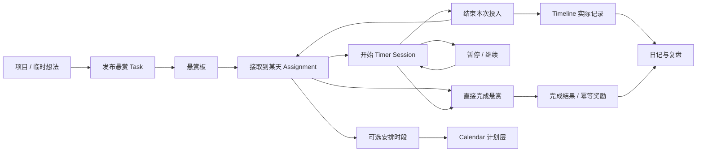
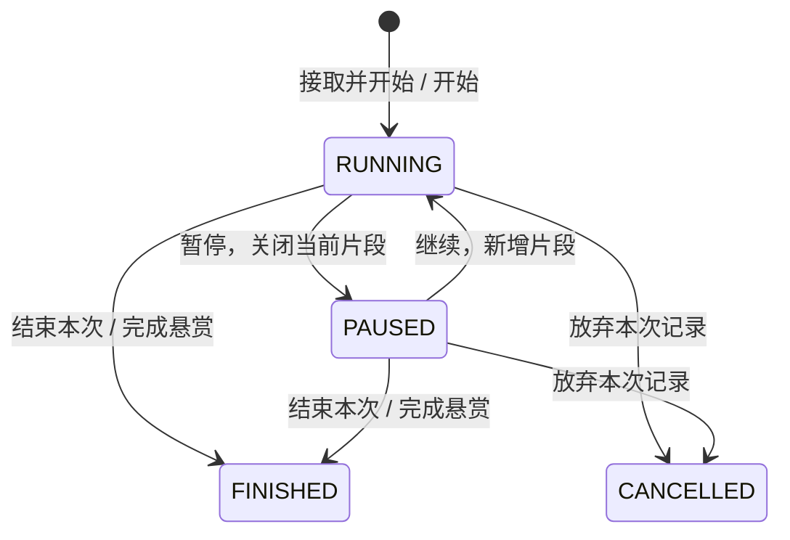

# Workbench vNext 功能设计方案

版本：v1.0 · 2026-09-17 · 待实施  
配套：[PRD](PRD_VNEXT.md) · [开发计划](DEVELOPMENT_PLAN_VNEXT.md) · [架构记录](ARCHITECTURE.md)

## 1. 核心闭环



用户可以先接取再安排，也可以不排时间直接开始；不计时的小任务可以直接完成。Project、Habit 和 Agent Candidate 都只能通过任务领域的公开创建／接取能力加入闭环。

## 2. 页面与交互

### 2.1 Today：今日悬赏是执行中心

桌面布局草图：

```text
┌ 日期 / 回到今天 ───────────────── 搜索 / 快速新增 / 用户 ┐
│ 当前专注：第三章练习  00:24:10  [暂停] [结束本次]       │
├─────────────────────────────┬─────────────────────────┤
│ 今日悬赏        [接取悬赏]   │ 今日 Timeline           │
│ 今日重点（最多 3 个）        │ [计划] [实际] [生活]    │
│ □ 第三章练习  40%   [开始]   │ 09:00 计划 学习         │
│ □ Workbench PRD     [开始]   │ 09:10–09:55 实际 学习   │
│ 其余已接取 / 已完成折叠      │             [安排/补录] │
│ [发布并接取] [查看完整悬赏板]│                         │
├─────────────────────────────┴─────────────────────────┤
│ 生活快照：睡眠 / 喝水 / 今日习惯                       │
│ 今日摘要：已完成 2/5 · 专注 1h20m · 计划 3h            │
│ 复盘入口：晨写已完成 / 日记待写 / 今日回顾              │
└───────────────────────────────────────────────────────┘
```

移动顺序：当前专注 → 今日悬赏 → Timeline → 生活快照 → 复盘；摘要保持紧凑。页面不展开商店、决策器、股票复盘编辑器或所有项目。

- 默认当天；历史日期显示“查看 9 月 16 日”，补录和日记可写历史，实时开始始终属于真实当前时间。
- 查看历史时点击开始，提示“将接取到今天并开始”，不伪造历史开始时间。
- 今日重点存在 Assignment 上，最多 3 个；Task pinned 仍表示长期重要，两者不相互覆盖。
- 无任务：显示“去接取悬赏”和“发布第一个悬赏”。全部完成：显示完成摘要和可选复盘入口。
- 跨页当前计时器固定；日期切换不改变活跃 Session。

### 2.2 悬赏板

页面主操作：“发布悬赏”。顶部视图：可接取 / 已接取 / 已完成 / 已归档；筛选支持 Inbox（未归项目）、项目、分类、优先级、截止日期／即将到期、关键词。默认展示未完成且未归档任务。

卡片信息按主次排列：

1. 标题与项目／类别，必要时显示逾期。
2. 进度、预计投入、截止日期；难度和奖励作为辅助信息。
3. 主按钮“接取到今天”；已接取显示“开始”或“继续”；运行中显示当前计时。
4. 更多操作：详情、编辑、安排时段、完成、归档。危险操作不挤在主按钮旁。

“接取悬赏”抽屉可以搜索、筛选、批量勾选，显示所选预计总时长；超过个人当天可用时间仅提示。建议每日 3 个重点，保留现有每次提交 30 项的保护上限，不能把 3 项做成强制任务总量上限。

发布表单只强制标题；分类可选“未分类”，默认中优先级／中难度；描述、项目、截止时间、预计分钟、初始进度都为展开项。提交按钮为“发布”和“发布并接取”；安排时段是可选项。创建 + 接取若作为组合操作提交，需同一事务，避免出现成功发布但用户误以为已接取。

任务详情包含：描述、状态、优先级、难度、类别、项目、截止日期时间、预计投入、进度、今日接取、计划时段、投入记录、完成说明、创建／更新／完成时间。桌面可抽屉打开但 URL 可直达；移动端为完整页面。

### 2.3 Calendar / Timeline

Timeline 是按日的统一视图，Calendar 是同一组计划和事实的日／周浏览器，两者复用同一统计与来源规则。

| 记录 | 展示 | 编辑入口 | 统计归属 |
| --- | --- | --- | --- |
| Planned Schedule | 虚线轮廓 + “计划”文字 | 日历编辑／拖动 | 计划时长 |
| Timer 产生的 Actual | 实色 + “计时”文字；关联悬赏 | 打开 Session 更正，不单独改投影 | 专注时长／实际投入 |
| 手动补录 Actual | 实色 + “补录”文字 | 编辑原补录 | 实际投入；不计入计时专注 |
| 当前运行片段 | 实时增长、标注“进行中” | 全局计时器 | 暂估值，已结算统计不纳入 |
| Sleep | 独立生活色层，可折叠 | Sleep 记录 | 睡眠统计 |
| Water / Habit 点事件 | 时间点、次数／数量 | 所属生活记录 | 生活统计，不占专注分钟 |

创建时先选“安排计划”或“补录实际”；录入起止日期时间、标题、可选任务／类别／说明。跨午夜使用完整起止日期，不以 `endTime < startTime` 猜测为次日。周视图允许查看、创建、编辑、移动计划；实际记录拖动需进入明确的更正流程。

计划生命周期：待执行 → 已执行 / 已取消 / 已改期。过期是时间推导的提示，不自动完成。实际投入可关联 `plannedScheduleId`；单次投入不自动宣告整个计划完成，用户在结束面板可勾选“本时段已执行”。任务完成也不把所有历史计划标成已执行。

计划重叠允许但提示。实际补录与已有投入重叠时先展示冲突，用户必须调整区间或明确“与现有记录重叠且不计入投入汇总”；后者仅为附注记录。睡眠与任务重叠只提示数据异常，生活与任务统计分开。

### 2.4 Projects

MVP 字段：名称、描述、状态、优先级、开始日期、目标日期、笔记、创建／更新时间、归档时间。Task 用可空 `projectId` 关联一个项目，暂不建立多对多关系表。

项目状态：PLANNING → ACTIVE ↔ PAUSED → DONE；任何非活跃执行状态可归档，归档支持恢复。结束项目时如有未完成悬赏，必须选“继续保留未完成任务”或“逐个处理”，不连带完成／删除任务。

项目详情：概览 / 悬赏 / 计划与投入 / 笔记。概览展示下一步、完成数量、目标日期、累计投入；可直接发布所属悬赏并接取。

项目进度按未归档任务的 `progressPercent` 等权平均，已完成计 100%，无任务显示“尚无任务”；分母变化可能使进度下降，界面可解释。项目 DONE 由用户确认，不由 100% 自动触发；累计投入从时间事实求和，不能把子任务耗时再重复相加。

R6 再增加里程碑（名称、目标日期、关联任务与完成条件），不加入甘特图、依赖图或 OKR 引擎。

### 2.5 Routines / Habits

R1 统一入口，保留现有 Sleep / Water 表；Morning Writing 从此处快速进入 Journal 的晨写编辑器。

R2 通用习惯支持：名称、是否启用、开始／结束日期、频率（每日／指定星期／每周 N 次）、记录模式（完成／次数／数量／分钟）、目标、单位、可选关联类别。历史按日／周显示达成、部分达成、跳过、未达成。跳过必须有明确状态，可写原因，不强迫补签。

- HabitDefinition 与生效日期明确的 HabitSchedule/HabitGoal 保存规则；HabitOccurrence 保存发生日和实际记录。修改频率只影响生效日后的计划，不重算过去的缺勤。
- 每日／指定星期习惯按应发生日算达成率；每周 N 次按周目标算，不虚构每天的未完成。
- Water 以专用记录为真值，习惯页从其累计数量派生；晨写以已保存的正文为达成依据，不另写一条独立打卡事实。
- Sleep 保存完整入睡／醒来时间，睡眠归属醒来日期；Timeline 按跨日片段显示，统计整晚时长一次。午睡／多段睡眠作为后续专用扩展，不塞通用 JSON。
- 可在某次习惯发生日“转为今日悬赏”，用 `(habitId, occurrenceDate)` 保证不重复生成；简单二元习惯可设置完成关联任务后达成，数量型以实际记录为准，二者不重复奖励。

### 2.6 Journal / Review

统一入口下有日记、晨间书写、复盘和归档。按日期打开原领域记录，不强行合表。

- 日记保留自由文字、开心的事、成果、学习、明日重点、心情；今日任务与时间摘要以可引用卡片显示。
- 晨写保持 daily ritual；正文由用户保存，Habit 只读达成状态。
- 股票复盘保留现有字段，进入“复盘 → 股票复盘”；内容不产生 Finance 流水。
- R2 增加周复盘、项目复盘、学习复盘固定表单：期间／对象、成果、问题、下一步；投资复盘复用已有股票入口。先提供预设类型，不做任意表单设计器。
- 引用的摘要默认是动态来源链接；写入复盘正文时形成用户确认的文本快照，后来源记录变化不偷偷改正文。
- 初期显式保存 + 离开提醒 + 本设备恢复草稿。后台刷新不得覆盖未保存内容；保存遇到版本冲突提供比较与重新载入。
- 历史回归 Journal Archive；搜索结果直接打开对应日期／记录，不保留万能 History 一级页面。

### 2.7 Rewards / Growth / Insights / Tools

悬赏仍有“努力被记录”的反馈：卡片展示预计奖励，完成后显示实际奖励和简短反馈；支持减少动效和隐藏数字。Reward Shop、兑换历史、等级与能力图在 More。

- 保留任务难度与重要标记对应的既有奖励公式，R0 将当前数值固化为回归样例；卡片与后端共用同一规则，标明“预计”。
- 完成奖励按 `taskId` 首次完成发放一次；重新打开再完成不重复领取。任务重复事项应建立新 Task／Habit occurrence。
- 暂停不再发任务阶段奖励；结束 Session 按净投入结算一次计时奖励（沿用当前每完整 25 分钟 5 XP / 1 金币的规则）。旧奖励不追扣；新旧策略记录生效版本。
- 结束 Session 并完成任务可以得到计时与任务完成两种不同奖励，各自仅一次。直接完成只发任务完成奖励，未计时不补造时长。
- 更正已结算时长需追加有来源的奖励调整，不能直接改历史 event；扣减导致余额不足时保留调整并暂停新兑换，直到可用余额恢复。历史余额不得静默归零。
- 关闭“展示”不改变奖励流水；若未来需要关闭“发放”则另立设置，不混成同一开关。
- 能力维度路径是 Task → Category → Dimension；累计目标是统计分类，不改变任务生命周期。
- Insights 展示周／月投入、完成、睡眠、习惯；AI 输出标记生成时间、来源范围与“分析建议”，可删除／重生成；不覆盖源事实。
- Decision Tools 独立维护决策记录；结果可通过明确操作“创建悬赏”，不自行修改 Task。后续增加加权决策、事前推演、结果回顾。

### 2.8 Search / Quick Add / Settings / Data

Search 首版基于各域普通数据库查询：关键词、类型、日期、分页；任务查标题／描述，文字记录查正文，日历查标题／备注。限定当前用户、排除删除记录，返回类型、摘要和深链。R2 纳入 Projects、Habits、Reviews，R4 才接入 Finance，财务结果默认隐藏金额直到展开。

Quick Add 选择任务、计划、日记、喝水；新领域上线后增加习惯记录、支出。它调用各域 API，不创建 Universal Workbench Item。

Settings：资料、任务分类、能力维度、习惯目标、奖励展示／规则说明、外观、结转偏好、集成、数据。分类停用不删除历史投入；原分类名／颜色作为历史快照保留，能力报表可按当前映射重算并注明口径。

Data：分域 JSON / CSV 导出，文字额外支持 Markdown；敏感导出由用户主动操作。R2 导入先预览、校验、报告重复／失败行，再以批次键提交；不能因一行错误悄悄丢其他数据。备份恢复先做独立环境演练，回收站与数据库备份不是同一能力。

## 3. 生命周期与异常规则

### 3.1 Task / Assignment

| 对象 | 状态与动作 | 规则 |
| --- | --- | --- |
| Task | TODO → IN_PROGRESS → DONE；TODO 可直接 DONE | 开始计时进入 IN_PROGRESS；暂停／结束本次不完成 Task |
| Task 重新打开 | DONE → TODO / IN_PROGRESS | 用户指定进度（默认 0%）；保留既有投入、完成事件与奖励，不重复发完成奖励 |
| Task 归档 | TODO / IN_PROGRESS / DONE → ARCHIVED | 有未结束 Session 时需先处理；保存归档前状态以便恢复 |
| Assignment | ACCEPTED → RELEASED；可再接取 | 唯一 `(userId, taskId, taskDate)`，恢复原记录不重复插入；释放仅撤回当天安排 |
| Assignment 当日结果 | 未开始／有投入／当日完成 | 投入由该日事实派生；当日完成保存日期明确的完成结果，不用 Task 当前状态回推过去 |

跨多日 Task 可有多个 Assignment。完成只更新完成发生日的有效接取结果；昨日“有投入未完成”保持不变。未接取直接完成时，可原子创建当日 Assignment 使今日统计可解释；历史补登记完成需用户明确选择完成日期。

撤回有历史投入的 Assignment 不删时间事实：Today 折叠到“已撤回但有投入”。日完成率分母排除纯撤回项，但保留已经开始或完成后撤回的项，避免通过移除任务美化统计。

### 3.2 Timer 状态机



Session 下有若干 TimerSegment，每段记录真实起止时刻。暂停关闭片段并写入 Timeline；继续开启新片段；净投入为片段时长总和。FINISHED 不可 resume，再开始会创建新 Session。

“结束本次”面板展示净投入、实际片段、可选进度／备注，默认任务继续；另有明确按钮“完成悬赏并结束”。完成处不再强制填写起止时间；补录是独立可选项。

同一用户最多一个 RUNNING 或 PAUSED Session，由服务端串行锁定用户执行状态后检查和写入，不能只靠浏览器禁用按钮。第二设备拿到冲突时显示当前任务并跳转；同一个开始操作重试返回原结果。

取消是“放弃本次记录”，二次确认后 Session 与其时间投影作废，不发计时奖励，任务保留未完成；结束并保留记录无需走取消。已经 FINISHED 的记录走更正／软删除，不倒退 Session 状态。

### 3.3 日期、补录、失败

| 情况 | 行为 |
| --- | --- |
| 跨午夜 | Session 不自动结束；区间按上海日界拆分显示，23:50–00:20 显示 10 + 20 分钟，总投入 30 分钟 |
| 暂停跨日 | 暂停空档不生成任何时间块；继续发生在新日期，必要时原子补当日 Assignment |
| 睡眠跨日 | 时间轴分日显示；整晚睡眠统计仅归醒来日，不在两天各加一整晚 |
| 网络断开 | 浏览器可继续估算显示，但标记“待连接核对”；暂停／结束只有服务端确认才显示已保存；不引入离线写队列 |
| 结束响应丢失 | 使用相同幂等键重试并查询 Session；返回相同时间块、状态和奖励结果 |
| 长时间忘记停止 | 恢复时提示核对起止时间；不偷偷截断或自动发奖。首次阈值设 4 小时，可在设置调整 |
| 更正片段 | 保留更正原因／时间，重建关联 Timeline 片段、重算统计；不允许直接改关联投影绕过 Session |
| 补录已有 Task | 明确选择是否完成；只记录时长的默认动作不完成 |
| 同时编辑 | `expectedVersion` 不匹配返回 409，保留草稿并显示冲突，不覆盖另一端 |
| 归档／删除 Task | 不级联删除实际记录与奖励；历史使用标题／类别快照；运行 Session 必须先结束／取消 |

### 3.4 日结转

默认每天首次打开 Today 时只读展示最近未处理日的待续接列表。用户选择任务“接取到今天”，或者设置授权自动接取；自动模式由 Web 显式调用 `POST /api/daily-rollover`，未来也可由 Workbench job 调用。

幂等键包含用户、源日期、目标日期和结转批次；同一任务目标日期唯一。跨多天未登录时扫描未处理来源并去重，不只看昨天。目标日期已有手动接取时只合并，不覆盖排序、重点或撤回决定。

任务续接不复制旧计划的时钟位置；过期计划显示“待重新安排”，用户选新时段后保存。读取历史或未来日期不会触发结转。旧的自动复制安排行为在 R1 明确迁移，提供一次说明。

## 4. 数据归属与目标契约

本节是拟实施契约。现有字段和接口仍按当前代码运行，不能在调用方假定以下字段已经存在；落地时需同步 ARCHITECTURE、OpenAPI、schema 与迁移。

| Owner | 真值／对象 | 跨领域公开能力 |
| --- | --- | --- |
| Tasks | Task、TaskDailyAssignment、完成历史 | 查询／详情、发布、接取、释放、状态命令 |
| Execution workflow | TimerSession、TimerSegment；执行事务编排 | start / pause / resume / finish / cancel / correct；调用奖励公开契约 |
| Calendar | Planned Schedule、手动 Actual | 查询／CRUD／改期；接收由执行工作流维护的计时投影 |
| Today | 当日组合读模型 | 纯读取；无自己的事实表 |
| Projects | Project、笔记，后期 Milestone | 项目 CRUD；任务关联由 Tasks 验证 projectId |
| Routines | HabitDefinition、Schedule、Goal、Occurrence；现有专用生活记录 | 目标／打卡／汇总；不复制晨写正文 |
| Journal | 日记、晨写、复盘正文与归档 | 保存／版本更新／按期查询 |
| Rewards | reward_events、成长、兑换 | 同事务幂等奖励与冲正；不决定 Task 是否完成 |
| Finance | 账户、分类、账本、预算等 | 独立财务命令／查询，见 Finance PRD |
| Integrations | Grant、Candidate、操作审计 | 授权检查、候选确认，调用业务 owner；不直接改其他领域表 |

### 4.1 Timer 与 Schedule 的单一真值

保留现有 Schedule 的 PLANNED / ACTUAL 结构以降低迁移风险；两者是记录类型，另有计划生命周期，不能用 `completed` 代替所有状态。

- TimerSegment 是计时的真实来源。计时生成的 Actual Schedule 只是 Timeline 投影，增加 `timerSessionId`、`timerSegmentId`、`sliceDate`，唯一键保证每段每天最多一条投影。
- 跨日片段按日界拆投影，所有投影携带来源；Schedule 补充完整起止时刻，兼容旧 date/time 字段，不以 `24:00` 伪造跨日。
- 手动 Actual 的真值就是 Schedule；增加投入汇总标记用于明确排除重叠附注。
- 统计只读取一个规范化的实际投入集合，不能再把 TimerSegment 和其 Schedule 投影相加。
- 修改源片段时同事务更新／作废投影。普通 Schedule 更新 API 拒绝编辑 TIMER 来源，返回原记录编辑入口。
- 旧 TIMER Schedule 没有源 ID 时，不按标题／近似时间强行关联；可唯一匹配才补关联，其余标记 legacy 来源。旧期间继续以既有 Actual Schedule 作为统计依据，不再把旧 Timer 行额外补进统计。切换时间与旧记录 ID 范围须记入迁移报告。

### 4.2 统计口径

| 指标 | 明确口径 |
| --- | --- |
| 今日接取数 | 指定日期有效 Assignment，加已产生投入／完成事实后撤回的 Assignment；不含纯撤回项 |
| 今日完成率 | 上述集合中该日确认完成的任务数 / 接取数；分母为 0 显示“—” |
| 今日专注 | 指定日内有效、已关闭的 TimerSegment 秒数之和；运行片段以“进行中 + X”独立显示 |
| 今日实际投入 | 有效计时投影 + 计入汇总的手动／legacy Actual，按日裁切；排除取消／删除／重叠附注 |
| 今日计划 | 未取消 Planned 区间总量；重叠另提示，“占用时间”如展示则取区间并集，不能冒充同一指标 |
| Task／Project 投入 | 规范化实际集合按 taskId / projectId 聚合；同一记录一次 |
| 类别 100h 进度 | 同一实际集合按历史 categoryId 求和，分母为用户目标；能力映射变化只影响维度报表 |
| 周完成 | 周一 00:00 至下周一 00:00 内的完成事件，按 taskId 去重，不读取所有当前 DONE 任务数量 |
| 习惯达成率 | 应发生次数／目标中实际达成份额；跳过单列，不能当已完成；历史规则按当时生效版本 |

时间内部按秒累计，展示时统一换算分钟，禁止每个短片段向上取整后相加。以上区间统一左闭右开，时区 Asia/Shanghai。

### 4.3 API 交付清单（目标）

| 能力 | 拟新增／补齐接口 | 关键约束 |
| --- | --- | --- |
| Today | `GET /api/today?date=` | 纯读，摘要和深链；保留旧 dashboard 兼容期 |
| Task | `GET /api/tasks`、`GET /api/tasks/:id`、现有 create/update；完成／归档命令 | 筛选分页；create 分类可空；优先级／预计时长可编辑 |
| 接取 | 保留 `GET/PUT /api/task-days`，补单项 accept/release 与组合接取开始 | 逐步停止无版本全量替换；日期列表 revision 防并发覆盖 |
| 执行 | `GET /api/timer-sessions/current`、`GET /api/timer-sessions/:id`；start / pause / resume / finish / cancel / correct | 沿用现有 start、pause、finish 方法路径兼容迁移；finish body 显式 `completeTask` |
| 时间 | `GET /api/schedules`、`GET /api/schedules/:id`、POST / PUT / DELETE | 日期范围／kind／task 筛选；编辑来源限制；删除软删除 |
| 结转 | `POST /api/daily-rollover` | 显式命令、可重试、按日幂等 |
| Projects | `/api/projects`、`/api/projects/:id` | 独立 CRUD，version、归档恢复 |
| Routines / Review | `/api/habits`、occurrences、`/api/routines/summary`；review 查询／保存 | 保留 sleep/water/writing 原接口，新增不强行合表 |
| 搜索／配置 | `GET /api/search`、`/api/settings`、分域 export/import | 用户隔离、分页、导入预览 |

Envelope 保留 `{code,message,data}`，逐步补 `meta.requestId/generatedAt`；错误补 type、retryable、fieldErrors。Task、Schedule、Project、Journal 等可编辑对象引入 version，更新携带 expectedVersion；重复 mutation key 同参数返回原结果，不同参数返回冲突。完成、结束计时、奖励、兑换、导入、财务和 Agent 写入优先具备幂等性。

`packages/contracts` 分任务／时间核心契约先落地，输入 Zod 与 DTO 共用；不放业务查询。OpenAPI 同步维护与聚焦契约检查，不再另建 `apps/web/contracts` 作为第二套权威 schema。具体目录与依赖边界以架构记录为准。

## 5. Agent Bridge 与远期补齐

### 5.1 Bridge v1

Settings → Integrations 建立独立 Grant（连接方、scope、有效期、撤销时间）；独立集成凭据不复用用户 Web token。

第一版 scope 为 `today:read`、`tasks:read`、`task-candidates:write`，可选择额外授权具体低风险 Task 命令。Today 的 Bridge 投影采用字段白名单，仅返回任务、当前专注和普通计划；Sleep、Water、Journal 和 Finance 不因混在 Web Today 中而泄露。

Candidate 包含建议标题、描述、预计时间、建议日期、来源、状态；PENDING → ACCEPTED / REJECTED / EXPIRED。确认面板支持“仅发布”和“发布并接取”；确认调用 Tasks 公开命令，候选来源键保证只生成一个 Task。自动允许的低风险命令须逐项授权，可随时关闭。

所有写入保留操作方、目标、结果和时间；使用 version 与幂等键；Agent 无法直连数据库或覆盖用户冲突修改。Bridge 响应提供事实、生成时间、深链，不输出角色心理／安慰策略。普通、个人、敏感权限分层，正文与财务默认不授权。

### 5.2 Inventory 与扩展功能

R6 Inventory MVP：物品名、类别、所在位置、持有／借出／维修／处置状态、购入日期、可选购入价与保修截止；详情能查看维护悬赏。购入价是物品属性，真实交易引用 Finance 流水，不能双写另一套余额。维护提醒生成候选悬赏，确认后接取。

R6 Calendar 补月视图、重复安排、通知开关；修改单次与修改整个系列必须分开。通知失败不改变任务状态。R6 Decision Tools 补比较表、权重分数、事前风险和结果回顾。Activity Feed 如需要只聚合现有事件；健康集成等另做数据权属评估，不默认建设完整健康平台。

## 6. 视觉、通用状态与验收样例

保留奶白、薄荷绿、樱花粉和轻量玻璃面板；悬赏卡更突出标题、接取与开始，奖励是次级提示。计划／实际靠文字和边框共同区分，不只用颜色。

复用已有样式形成最小 Button、Input、Modal/Drawer、Panel、Tabs、Badge、Skeleton、Empty/Error、Toast；从实际页面提取，不单独搭大型设计系统。弹窗要焦点约束、ESC、关闭后焦点回到触发处；错误关联表单输入；支持 reduced motion。

每页提供 Loading / Empty / Error / Ready；网络旧数据注明更新时间，失败时可重试且保留草稿。未保存关闭需提醒；删除可恢复，真正永久清理走单独明确操作。

| 编号 | 操作 | 期望 |
| --- | --- | --- |
| AC-01 | 接取同一任务两次 | 一个当日 Assignment，顺序稳定 |
| AC-02 | 09:00 开始、09:20 暂停、09:30 继续、10:00 结束 | 两段 Actual，净投入 50 分钟，任务仍 IN_PROGRESS |
| AC-03 | 对 AC-02 重试结束／跨设备同时结束 | 返回同一结果；时间和计时奖励不重复 |
| AC-04 | 23:50–次日 00:20 完成悬赏 | 两日 10/20 分钟；任务只完成一次，完成奖励一次 |
| AC-05 | 直接完成 2 分钟小事且未补录 | 有完成事件，无虚构 Actual，无计时奖励 |
| AC-06 | 补录 30 分钟，不选完成 | 时间轴与统计增加 30 分钟，任务状态保持未完成 |
| AC-07 | 第二设备开始另一个任务 | 409 并显示已有 Session，不出现两个活跃执行 |
| AC-08 | 连续 GET Today／历史／Bridge | 数据库业务行不变化；不存在初始化成长等隐式写入 |
| AC-09 | 昨日接取、今日完成后查看昨日 | 昨日仍为有投入／未完成，今日记录完成 |
| AC-10 | Journal 有未保存文字时完成 Task | 字段不被刷新覆盖；离开可恢复草稿 |
| AC-11 | 只有 task/today scope 的 Agent 读取 Today | 无睡眠、喝水、日记正文、财务字段 |
| AC-12 | 旧 TIMER Schedule 无法唯一关联 | 标记 legacy 并计入一次；不根据猜测删除／复制历史 |

